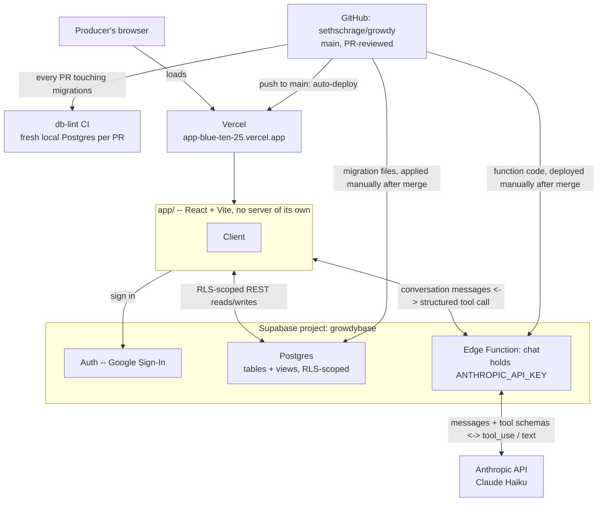

# Architecture

Where the pieces actually run and how they talk to each other. This
complements [`docs/data-model.md`](data-model.md) (the shape of the data)
and [`docs/decisions/`](decisions) (why each piece exists) with the one
view neither gives on its own: what's deployed where, and what deploys
itself versus what has to be deployed on purpose.

## Reading this diagram

- **Three deploy paths, three different amounts of automation.** Vercel
  is connected straight to GitHub and deploys the app on every push to
  `main` with no manual step -- see
  [`docs/decisions/0008`](decisions/0008-app-as-research-tool.md). A
  migration or an Edge Function change is the opposite: written and
  reviewed in a PR, then applied or deployed to Supabase by hand, only
  after that PR merges, never before -- see
  [`CONTRIBUTING.md`](../CONTRIBUTING.md). Both are correct for what they
  are: the app has no secrets and nothing to lose by shipping instantly;
  Supabase holds real producer data and the only API key this project
  has, so nothing reaches it without a human merging first.
- **The Edge Function never touches the database.** Its only job is one
  round trip to Anthropic: take the conversation, return either a
  question or a structured tool call. Every actual read or write against
  Postgres happens from the client, under the signed-in producer's own
  RLS-scoped session -- see the comment at the top of
  [`supabase/functions/chat/index.ts`](../supabase/functions/chat/index.ts)
  and [`docs/decisions/0010`](decisions/0010-read-only-qa-chat.md). That
  split, not which function holds which tool, is the actual safety
  backstop.
- **The double arrow between the app and the Edge Function** is the
  tool-use round trip itself: the app sends conversation messages, gets
  back a structured intent (a query to resolve or an observation to
  draft), resolves that itself against Postgres, and -- for a question --
  sends the result back so the model can compose the actual reply instead
  of a canned template -- see
  [`docs/decisions/0013`](decisions/0013-model-composed-query-answers.md).
- **Supabase Storage isn't in this diagram.** It's listed in
  `README.md`'s stack table as a future concern for photo attachments,
  but no bucket exists yet and nothing in the app uses it --
  deliberately deferred, see
  [`docs/decisions/0009`](decisions/0009-chat-based-observation-submission.md).
- **CI is independent of both deploy paths.** `db-lint` runs against a
  disposable local Postgres on every PR that touches a migration; it
  never touches the live `growdybase` project either way.
