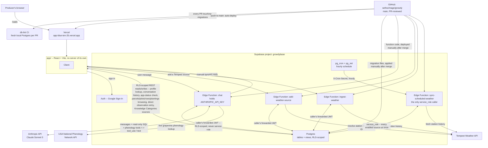
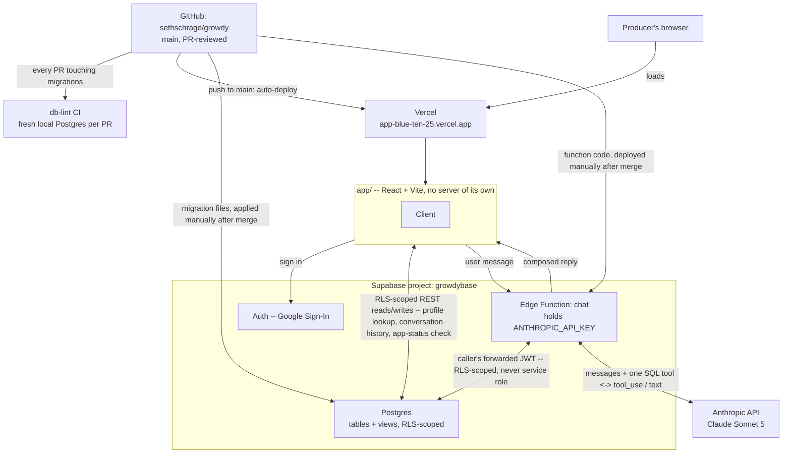
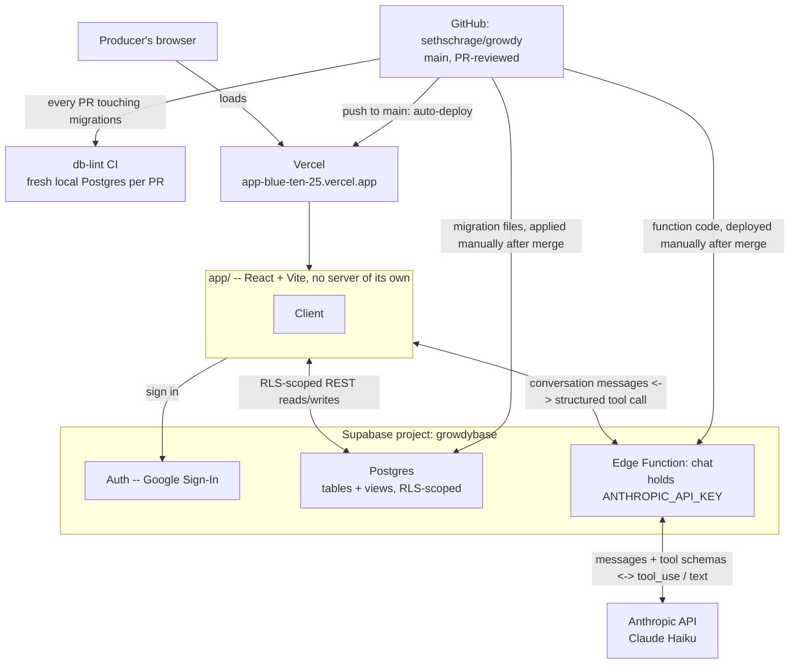

# Architecture

Where the pieces actually run and how they talk to each other. This
complements [`docs/data-model.md`](data-model.md) (the shape of the data)
and [`docs/decisions/`](decisions) (why each piece exists) with the one
view neither gives on its own: what's deployed where, and what deploys
itself versus what has to be deployed on purpose.

```mermaid
flowchart TD
    GH["GitHub: sethschrage/growdy<br/>main, PR-reviewed"]
    CI["CI on every PR<br/>db-lint: fresh local Postgres + schema/doc checks<br/>web: tsc, oxlint, vitest"]
    Vercel["Vercel<br/>app-blue-ten-25.vercel.app"]
    Browser["Producer's browser"]
    iPhone["Producer's iPhone<br/>growdy iOS app (not yet shipped)"]
    PublicViewer["Signed-out visitor<br/>with a shared link"]

    GH -->|every PR touching migrations| CI
    GH -->|"push to main: auto-deploy"| Vercel
    Browser -->|loads| Vercel
    GH -->|"cap sync + Xcode build, manual, unreleased"| iPhone
    PublicViewer -->|"/a/:id, no sign-in"| Vercel

    subgraph App["app/ -- React + Vite, no server of its own"]
        Features["Features<br/>chat, observations, producer, artifacts"]
        DataLayer["src/data/ -- typed query layer<br/>every table, view and RPC call"]
        Features --> DataLayer
    end
    Vercel --> App
    iPhone -->|"runs a bundled copy of dist/ -- no Vercel at runtime"| App

    subgraph Supabase["Supabase project: growdybase"]
        Auth["Auth -- Google Sign-In<br/>web: OAuth redirect; iOS: native ID token"]
        DB["Postgres<br/>tables + views, RLS-scoped"]
        Storage["Storage: observation-photos<br/>private bucket, tenancy on the object path"]
        Cron["pg_cron + pg_net<br/>1 hourly + 2 six-hourly schedules"]
        ChatFn["Edge Function: chat<br/>holds ANTHROPIC_GROWDY_KEY, VOYAGE_API_KEY"]
        AddWeatherFn["Edge Function: add-weather-source"]
        IngestFn["Edge Function: ingest-weather"]
        SyncFn["Edge Function: sync-scheduled-weather"]
        ScanFn["Edge Function: scan-conversations-for-observations"]
        EmbedFn["Edge Function: embed-scheduled-memory"]
    end

    GH -->|"migration files, applied manually after merge"| DB
    GH -->|"function code, deployed manually after merge"| ChatFn
    GH --> AddWeatherFn
    GH --> IngestFn
    GH --> SyncFn
    GH --> ScanFn
    GH --> EmbedFn

    App -->|sign in| Auth
    App <-->|"RLS-scoped REST reads/writes -- profile lookup, conversation history, app-status check, parcels/plots/rows/plantings browsing, direct observation entry, Knowledge Categories sources, artifact share/delete"| DB
    PublicViewer -->|"get_public_artifact(id) -- the one anon-reachable RPC, see 0027"| DB
    App <-->|"upload a photo on attach; read one back through a 5-minute signed URL"| Storage
    ChatFn -->|"signed URL under the caller's own JWT, then the bytes"| Storage
    App -->|"user message, accept: text/event-stream"| ChatFn
    ChatFn -->|"the answer as it is composed -- SSE; one JSON object for a caller that didn't ask"| App
    ChatFn <-->|"caller's forwarded JWT -- RLS-scoped, never service role"| DB
    ChatFn <-->|"messages + read-only SQL + write proposals + memory search + phenology + web access tools <-> tool_use / text"| Anthropic["Anthropic API<br/>Claude Sonnet 5"]
    ChatFn -->|"live grapevine phenology lookup"| USANPN["USA National Phenology<br/>Network API"]
    ChatFn -->|"embed a search query"| Voyage["Voyage AI (via MongoDB)<br/>embeddings API"]
    App -->|"add a Tempest source"| AddWeatherFn
    AddWeatherFn <-->|"caller's forwarded JWT"| DB
    AddWeatherFn -->|"resolve station ID -> device ID"| Tempest["Tempest Weather API"]
    App -->|"manual sync"| IngestFn
    IngestFn <-->|"caller's forwarded JWT"| DB
    IngestFn -->|"fetch station history"| Tempest
    Cron -->|"X-Cron-Secret, hourly"| SyncFn
    SyncFn <-->|"service_role -- every enabled source at once"| DB
    SyncFn -->|"fetch station history"| Tempest
    Cron -->|"X-Cron-Secret, every 6h"| ScanFn
    ScanFn <-->|"service_role -- every unscanned conversation"| DB
    ScanFn -->|"classify transcript -> candidate observations"| Anthropic
    Cron -->|"X-Cron-Secret, every 6h"| EmbedFn
    EmbedFn <-->|"service_role -- every unembedded row"| DB
    EmbedFn -->|"embed memory entries + conversation chunks"| Voyage
```

## Reading this diagram

- **The client is one box here and six folders inside it.** `app/` is the
  shell -- the router, the burger menu, the login and dead-end screens --
  with the menu's own arithmetic beside it in `labelDrag.ts` and
  `menuOpenness.ts`, because a pointer gesture is miserable to test
  through a DOM and trivial to test as a function. Features (chat,
  observations, producer data, artifacts) hold the components and their
  hooks; `app/src/data/` holds every table, view and RPC call the client
  makes, typed against the generated schema in `data/schema.ts`; `lib/`
  is platform and pure logic both -- the Supabase client itself, native
  sign-in, the camera and the photo bucket, and beside them the offline
  observation queue, connectivity, the knowledge screen's vocabulary,
  the native keyboard's accessory bar and how a glass control presses,
  none of which any one feature owns; `ui/` shared presentation; and
  `styles/` fifteen stylesheets whose import order in `styles/index.css`
  *is* the cascade -- `liquid.css` is last because it replaces the wood
  and the cream glass on the floating controls rather than adding to
  them, so moving that line changes what the app looks like. Two things
  deliberately sit outside `data/`: auth calls
  (`supabase.auth.*`), which are a different API rather than this
  project's data, and Storage reads and writes, which live in
  `lib/photo.ts` because the object path is the tenancy check there.
  See [`0032`](decisions/0032-client-organised-by-feature.md).
- **Four deploy paths, four different amounts of automation.** Vercel
  is connected straight to GitHub and deploys the app on every push to
  `main` with no manual step -- see
  [`docs/decisions/0008`](decisions/0008-app-as-research-tool.md). A
  migration or an Edge Function change is the opposite: written and
  reviewed in a PR, then applied or deployed to Supabase by hand after
  that PR merges. For a migration that is absolute -- a schema applied
  ahead of review is a change nobody agreed to, and the one thing here
  that cannot be undone by redeploying. A *function* may go first when
  the live function is the only place the change can be verified: a
  prompt cache reports hits only against the real API, a stream only
  breaks against a real model, and this plan has no branch deploys to
  reproduce a production failure on. Then the PR goes up the same
  session carrying what the deploy measured, and says it was deployed
  first -- [`CONTRIBUTING.md`](../CONTRIBUTING.md) step 7 has the four
  conditions. Both are correct for what they are: the app has no secrets
  and nothing to lose by shipping instantly; Supabase holds real
  producer data and the only API key this project has, so nothing
  reaches it that a person did not put there on purpose. The iOS
  app is the fourth and least automated: `dist/` is copied into
  `app/ios/` by `npx cap sync` and built in Xcode by hand, so a web
  change that has already auto-deployed to Vercel is still stale on a
  phone until someone syncs and rebuilds. Nothing about that path is
  live yet -- see [`0029`](decisions/0029-ios-shell-and-native-sign-in.md).
- **Six Edge Functions now, not one**, each scoped to exactly what it
  needs: `chat`, `ingest-weather`, and `add-weather-source` all build
  their own per-request Postgres client from the caller's forwarded JWT,
  never the service role key, so every query they run is RLS-scoped
  exactly as if the browser ran it directly (see
  [`docs/decisions/0016`](decisions/0016-chat-queries-directly.md) and
  the comment at the top of
  [`supabase/functions/_shared/supabaseClient.ts`](../supabase/functions/_shared/supabaseClient.ts)).
  Those same three deploy with `verify_jwt: false`, because Supabase's
  gateway check can't be exempted for the CORS preflight alone, so each
  one resolves its caller to a producer itself before doing any work.
  (All six carry that flag, in fact -- the other three for the unrelated
  reason below, that `pg_cron` is not a signed-in user. No function in
  this project has a gateway check; what differs is which self-check it
  runs.)
  That second half is not a detail of the first: RLS bounds what a
  request can read, and `chat`'s expensive part is an Anthropic call
  rather than a query, so for six days an anonymous `POST` to it got a
  real model answer on this project's key out of an empty database (see
  [`0020`](decisions/0020-scheduled-weather-sync.md)'s 2026-09-21
  update).
  What that scoping costs depends entirely on how the policy is written:
  every tenancy predicate compares against a producer id resolved once
  per statement, because the obvious form -- a helper called with the
  row's own column -- runs once per row and measured a hundred times
  slower, enough to blow the chat's five-second statement timeout on a
  weather question (see
  [`docs/decisions/0036`](decisions/0036-rls-predicates-are-evaluated-once.md)).
  `sync-scheduled-weather` was once the one deliberate exception; it's
  now one of three `service_role` callers, alongside
  `scan-conversations-for-observations` and `embed-scheduled-memory` --
  all three exist for the identical reason, nobody is signed in when
  `pg_cron` fires them, and all three verify a Vault-stored
  `X-Cron-Secret` before doing anything, the one deliberately narrow,
  cross-producer exception this project allows (see
  [`docs/decisions/0020`](decisions/0020-scheduled-weather-sync.md)).
- **Four external APIs now, not one.** Alongside Anthropic, `chat` also
  calls the USA National Phenology Network's public API directly, live,
  per question -- no ingestion, nothing stored locally, since it's a
  shared dataset queried at chat-time rather than a per-producer feed
  (see [`docs/decisions/0019`](decisions/0019-external-data-channels.md)'s
  prediction that a future source would need a genuinely different
  shape). Tempest is called from three different places for two different
  reasons: `add-weather-source` resolves a producer-entered station ID to
  the device ID Tempest's observations endpoint actually requires,
  `ingest-weather` backfills/refreshes on a producer's own manual action,
  and `sync-scheduled-weather` does the same on `pg_cron`'s hourly clock
  -- but the actual fetch/parse/validate/upsert logic lives once, in
  `_shared/weatherIngest.ts`, not duplicated across the two ingestion
  paths. Voyage AI (via MongoDB, since its 2024 acquisition) is the
  newest -- called from `chat` to embed a search query live, and from
  `embed-scheduled-memory` to embed memory entries/conversation chunks on
  its own 6-hourly clock, both through the same `_shared/voyage.ts` (see
  [`docs/decisions/0023`](decisions/0023-producer-memory-via-embeddings.md)).
- **The answer arrives in pieces, and the prompt above it is cached.**
  `chat` reads the request's `accept` header: a caller asking for
  `text/event-stream` is sent each model turn, each tool call, each piece
  of text and what the turn cost as they happen, and the client reads
  them off `response.body.getReader()` in `app/src/data/chat.ts`. A
  caller that doesn't ask gets the single JSON object this function has
  always returned, and that path is kept rather than retired for two
  reasons: the function is deployed by hand and the client by Vercel, so
  either can be the newer one for a while, and a stream that dies with
  nothing received is asked again buffered -- a second model turn is the
  right price for the difference between a slow answer and none. The
  instructions, the tool definitions and the schema description sit above
  the messages under a cache breakpoint, with the producer's enabled
  Knowledge sources under a second one, so a turn re-reads roughly 15,000
  tokens instead of re-sending them -- which only holds while nothing
  per-request sits in that prefix, since the cache matches exact text and
  one volatile token makes every request a miss that also pays the write
  premium (see [`0033`](decisions/0033-what-goes-in-the-cached-prompt.md)).
- **The app has one signed-out-reachable surface now.** A shared artifact
  link (`/a/:id`) calls `get_public_artifact(id)` directly from the
  browser -- no Edge Function, no session -- the first and only place
  `anon` can reach Postgres at all, deliberately a narrow function lookup
  by exact id rather than an RLS grant to `anon` (a table grant could be
  turned into a listable collection; a function can't) -- see
  [`docs/decisions/0027`](decisions/0027-public-artifact-links.md).
- **The app's own direct connection to the database covers more ground
  than it used to** -- auth, the producer-id lookup, conversation-history
  logging (`docs/decisions/0011`), the `app_status` poll
  (`docs/decisions/0017`), Knowledge Categories' source management, and
  now two features the burger menu opens: browsing the producer's own
  parcel/plot/row/planting structure read-only, and entering a structured
  observation directly -- both deliberately outside the chat/model path
  entirely, going to Postgres under the producer's own RLS session. The
  observation does not go straight there. Every capture is written to an
  IndexedDB queue first, photo bytes and all, and delivered from it --
  immediately where there is signal, and when the radio comes back where
  there isn't -- so the code that runs in a block with no bars is the
  same code that runs at a desk with five, rather than a fallback nobody
  finds out is broken until they are standing in a vineyard (see
  [`0037`](decisions/0037-what-happens-with-no-signal.md)). Every actual
  *question* about vineyard data still goes through `chat`, which writes
  and runs its own SQL against Postgres rather than the client resolving
  a fixed set of query shapes.
- **Storage holds photos, and the path is the tenancy check.**
  `observation-photos` is private: nothing is readable by URL alone, and
  every view mints a 5-minute signed URL first. `storage.objects` has no
  producer column, so the RLS policies read the first path segment
  (`<producer_id>/...`) through `private.storage_object_producer()` --
  an upload that doesn't start with the caller's own producer is refused
  by the database rather than by the client. The `chat` function reads
  photos the same way, signing under the caller's forwarded JWT, so it
  cannot see a photo the producer couldn't. Deferred since
  [`0009`](decisions/0009-chat-based-observation-submission.md) and
  built by [`0030`](decisions/0030-every-observation-through-one-queue.md).
- **CI is independent of every deploy path.** Two workflows run on every
  PR: `web` typechecks, lints and tests the client, and `db-lint` checks
  the docs against the repo -- links and anchors, ADR numbering, the Edge
  Functions this diagram draws -- and, when the PR touches migrations,
  builds a disposable local Postgres from all of them and checks the
  schema's own comments, the shape of the RLS policies, and the tables
  and scheduled jobs the docs name against that. A claim is checked only
  where something else can contradict it without anyone exercising
  judgement, which is the mechanical half; whether a paragraph here is
  still *true* is the author's, and it is the half that matters (see
  [`0035`](decisions/0035-what-the-docs-are-checked-against.md)). Neither
  touches the live `growdybase` project.
- **Every open tab also polls one small status check** -- a build-time
  version stamp plus a manually-toggleable `app_status.maintenance`
  flag -- and hard-blocks itself if either says something changed that
  it doesn't know about yet: a newer deploy, or a maintenance window
  flipped on before risky direct work against production. See
  [`docs/decisions/0017`](decisions/0017-app-status-forces-refresh.md).
- **A fourth surface exists outside this diagram entirely**: a Claude
  Code Remote session and a claude.ai Artifact dashboard, watching
  `growdybase` and Vercel and pushing a phone notification when
  something needs attention. It isn't drawn here because it isn't part
  of growdy's own deploy paths (nothing about it lives in this repo's
  CI, Supabase, or Vercel) -- see
  [`docs/monitoring.md`](monitoring.md#9-the-live-dashboard-and-scheduled-check----and-where-it-actually-lives)
  for exactly where it runs and its one real fragility.

## History

### 2026-09-19 -- before photos had somewhere to live ([0030](decisions/0030-every-observation-through-one-queue.md))

Storage was not in this diagram because there was no bucket: the
project had deferred photo attachment since `0009`. `0030` built it --
a private `observation-photos` bucket, written by the client on attach
and read by the `chat` function through a signed URL when it needs to
look at a photo rather than a description of one. The client box also
gains its internal shape here, now that every query goes through one
layer ([0032](decisions/0032-client-organised-by-feature.md)).

```mermaid
flowchart TD
    GH["GitHub: sethschrage/growdy<br/>main, PR-reviewed"]
    CI["db-lint CI<br/>fresh local Postgres per PR"]
    Vercel["Vercel<br/>app-blue-ten-25.vercel.app"]
    Browser["Producer's browser"]
    iPhone["Producer's iPhone<br/>growdy iOS app (not yet shipped)"]
    PublicViewer["Signed-out visitor<br/>with a shared link"]

    GH -->|every PR touching migrations| CI
    GH -->|"push to main: auto-deploy"| Vercel
    Browser -->|loads| Vercel
    GH -->|"cap sync + Xcode build, manual, unreleased"| iPhone
    PublicViewer -->|"/a/:id, no sign-in"| Vercel

    subgraph App["app/ -- React + Vite, no server of its own"]
        Features["Features<br/>chat, observations, producer, artifacts"]
        DataLayer["src/data/ -- typed query layer<br/>every table, view and RPC call"]
        Features --> DataLayer
    end
    Vercel --> App
    iPhone -->|"runs a bundled copy of dist/ -- no Vercel at runtime"| App

    subgraph Supabase["Supabase project: growdybase"]
        Auth["Auth -- Google Sign-In<br/>web: OAuth redirect; iOS: native ID token"]
        DB["Postgres<br/>tables + views, RLS-scoped"]
        Cron["pg_cron + pg_net<br/>1 hourly + 2 six-hourly schedules"]
        ChatFn["Edge Function: chat<br/>holds ANTHROPIC_GROWDY_KEY, VOYAGE_API_KEY"]
        AddWeatherFn["Edge Function: add-weather-source"]
        IngestFn["Edge Function: ingest-weather"]
        SyncFn["Edge Function: sync-scheduled-weather"]
        ScanFn["Edge Function: scan-conversations-for-observations"]
        EmbedFn["Edge Function: embed-scheduled-memory"]
    end

    GH -->|"migration files, applied manually after merge"| DB
    GH -->|"function code, deployed manually after merge"| ChatFn
    GH --> AddWeatherFn
    GH --> IngestFn
    GH --> SyncFn
    GH --> ScanFn
    GH --> EmbedFn

    App -->|sign in| Auth
    App <-->|"RLS-scoped REST reads/writes -- profile lookup, conversation history, app-status check, parcels/plots/rows/plantings browsing, direct observation entry, Knowledge Categories sources, artifact share/delete"| DB
    PublicViewer -->|"get_public_artifact(id) -- the one anon-reachable RPC, see 0027"| DB
    App -->|"user message"| ChatFn
    ChatFn -->|"composed reply"| App
    ChatFn <-->|"caller's forwarded JWT -- RLS-scoped, never service role"| DB
    ChatFn <-->|"messages + read-only SQL + write proposals + memory search + phenology + web access tools <-> tool_use / text"| Anthropic["Anthropic API<br/>Claude Sonnet 5"]
    ChatFn -->|"live grapevine phenology lookup"| USANPN["USA National Phenology<br/>Network API"]
    ChatFn -->|"embed a search query"| Voyage["Voyage AI (via MongoDB)<br/>embeddings API"]
    App -->|"add a Tempest source"| AddWeatherFn
    AddWeatherFn <-->|"caller's forwarded JWT"| DB
    AddWeatherFn -->|"resolve station ID -> device ID"| Tempest["Tempest Weather API"]
    App -->|"manual sync"| IngestFn
    IngestFn <-->|"caller's forwarded JWT"| DB
    IngestFn -->|"fetch station history"| Tempest
    Cron -->|"X-Cron-Secret, hourly"| SyncFn
    SyncFn <-->|"service_role -- every enabled source at once"| DB
    SyncFn -->|"fetch station history"| Tempest
    Cron -->|"X-Cron-Secret, every 6h"| ScanFn
    ScanFn <-->|"service_role -- every unscanned conversation"| DB
    ScanFn -->|"classify transcript -> candidate observations"| Anthropic
    Cron -->|"X-Cron-Secret, every 6h"| EmbedFn
    EmbedFn <-->|"service_role -- every unembedded row"| DB
    EmbedFn -->|"embed memory entries + conversation chunks"| Voyage
```

### 2026-09-18 -- before the iOS shell ([0029](decisions/0029-ios-shell-and-native-sign-in.md))

The app had exactly one delivery path: Vercel served it, a browser
loaded it. `0029` adds a second copy of the same client running from a
Capacitor shell, which reaches Supabase directly and never touches
Vercel at runtime -- so "where the app is served from" and "where the
app talks to" stopped being the same answer. Sign-in split at the same
time, since the OAuth redirect that works in a browser cannot complete
inside the shell. Before that, it was:

```mermaid
flowchart TD
    GH["GitHub: sethschrage/growdy<br/>main, PR-reviewed"]
    CI["db-lint CI<br/>fresh local Postgres per PR"]
    Vercel["Vercel<br/>app-blue-ten-25.vercel.app"]
    Browser["Producer's browser"]
    PublicViewer["Signed-out visitor<br/>with a shared link"]

    GH -->|every PR touching migrations| CI
    GH -->|"push to main: auto-deploy"| Vercel
    Browser -->|loads| Vercel
    PublicViewer -->|"/a/:id, no sign-in"| Vercel

    subgraph App["app/ -- React + Vite, no server of its own"]
        Client["Client"]
    end
    Vercel --> App

    subgraph Supabase["Supabase project: growdybase"]
        Auth["Auth -- Google Sign-In"]
        DB["Postgres<br/>tables + views, RLS-scoped"]
        Cron["pg_cron + pg_net<br/>1 hourly + 2 six-hourly schedules"]
        ChatFn["Edge Function: chat<br/>holds ANTHROPIC_GROWDY_KEY, VOYAGE_API_KEY"]
        AddWeatherFn["Edge Function: add-weather-source"]
        IngestFn["Edge Function: ingest-weather"]
        SyncFn["Edge Function: sync-scheduled-weather"]
        ScanFn["Edge Function: scan-conversations-for-observations"]
        EmbedFn["Edge Function: embed-scheduled-memory"]
    end

    GH -->|"migration files, applied manually after merge"| DB
    GH -->|"function code, deployed manually after merge"| ChatFn
    GH --> AddWeatherFn
    GH --> IngestFn
    GH --> SyncFn
    GH --> ScanFn
    GH --> EmbedFn

    App -->|sign in| Auth
    App <-->|"RLS-scoped REST reads/writes -- profile lookup, conversation history, app-status check, parcels/plots/rows/plantings browsing, direct observation entry, Knowledge Categories sources, artifact share/delete"| DB
    PublicViewer -->|"get_public_artifact(id) -- the one anon-reachable RPC, see 0027"| DB
    App -->|"user message"| ChatFn
    ChatFn -->|"composed reply"| App
    ChatFn <-->|"caller's forwarded JWT -- RLS-scoped, never service role"| DB
    ChatFn <-->|"messages + read-only SQL + write proposals + memory search + phenology + web access tools <-> tool_use / text"| Anthropic["Anthropic API<br/>Claude Sonnet 5"]
    ChatFn -->|"live grapevine phenology lookup"| USANPN["USA National Phenology<br/>Network API"]
    ChatFn -->|"embed a search query"| Voyage["Voyage AI (via MongoDB)<br/>embeddings API"]
    App -->|"add a Tempest source"| AddWeatherFn
    AddWeatherFn <-->|"caller's forwarded JWT"| DB
    AddWeatherFn -->|"resolve station ID -> device ID"| Tempest["Tempest Weather API"]
    App -->|"manual sync"| IngestFn
    IngestFn <-->|"caller's forwarded JWT"| DB
    IngestFn -->|"fetch station history"| Tempest
    Cron -->|"X-Cron-Secret, hourly"| SyncFn
    SyncFn <-->|"service_role -- every enabled source at once"| DB
    SyncFn -->|"fetch station history"| Tempest
    Cron -->|"X-Cron-Secret, every 6h"| ScanFn
    ScanFn <-->|"service_role -- every unscanned conversation"| DB
    ScanFn -->|"classify transcript -> candidate observations"| Anthropic
    Cron -->|"X-Cron-Secret, every 6h"| EmbedFn
    EmbedFn <-->|"service_role -- every unembedded row"| DB
    EmbedFn -->|"embed memory entries + conversation chunks"| Voyage
```

### 2026-09-17 -- before producer memory, conversation scanning, public artifacts, and the write tool ([0022](decisions/0022-chat-writes-data-with-audit-and-rollback.md), [0023](decisions/0023-producer-memory-via-embeddings.md), [0025](decisions/0025-parcel-sharing-and-self-serve-creation.md) follow-up, [0027](decisions/0027-public-artifact-links.md))

This diagram had fallen behind several real, already-shipped changes at
once, not just one -- caught while updating it for today's write-tool
work rather than let it drift further. The diagram above gained two
Edge Functions (`scan-conversations-for-observations`,
`embed-scheduled-memory`), a second and third `service_role` caller, a
fourth external API (Voyage AI), and the app's first signed-out-reachable
surface (`get_public_artifact`). Before all of that, it was:

### 2026-09-15 -- before external data channels and scheduled sync ([0019](decisions/0019-external-data-channels.md), [0020](decisions/0020-scheduled-weather-sync.md))

The diagram above gained three Edge Functions (`add-weather-source`,
`ingest-weather`, `sync-scheduled-weather`), `pg_cron`/`pg_net`, and two
external APIs (Tempest, USA National Phenology Network). Before that, the
whole system had exactly one Edge Function and one external API:

### Before 0016: client resolves, Edge Function never touches the database

The chat's shape changed materially in `0016` -- worth keeping the
prior diagram visible rather than only in `git log -p`, per this file's
own convention.

The Edge Function's only job was one round trip to Anthropic: take the
conversation, return either a question or a structured tool call
(`variety_lookup`, `parcel_lookup`, `planting_lookup`, `position_status`,
or `submit_observation_draft`). Every actual read or write against
Postgres happened from the client, under the signed-in producer's own
RLS-scoped session -- the double arrow between the app and the Edge
Function was the tool-use round trip itself: the app resolved a fixed
query shape or an observation draft, then sent the result back so the
model could compose the reply (`docs/decisions/0010`, `0013`).
