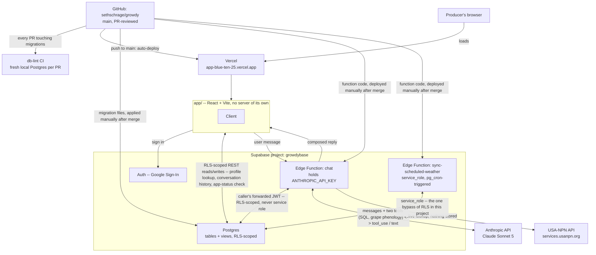
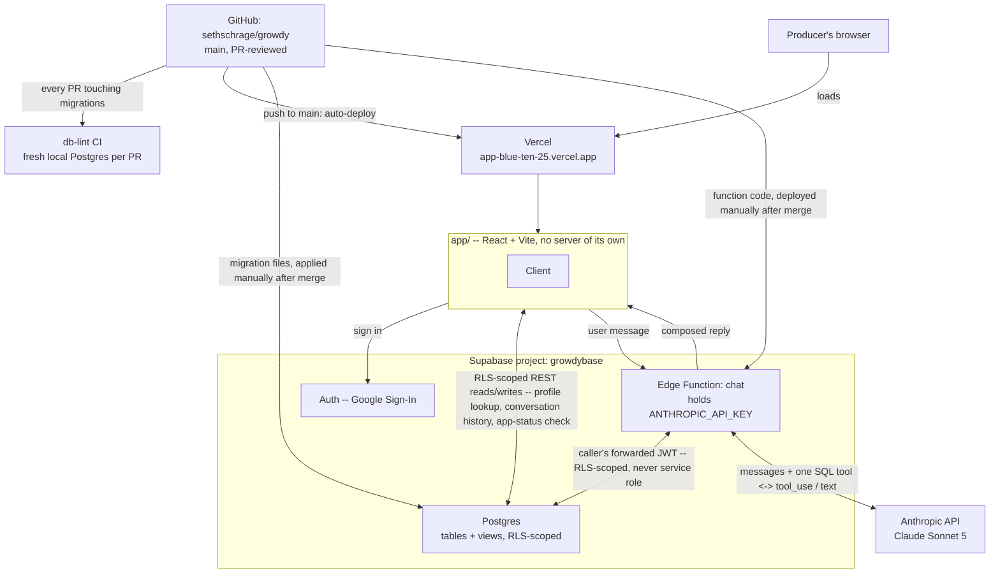
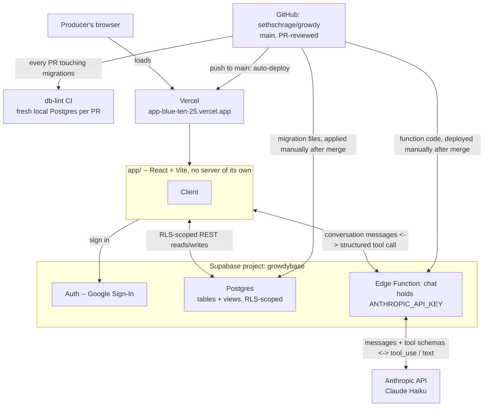

# Architecture

Where the pieces actually run and how they talk to each other. This
complements [`docs/data-model.md`](data-model.md) (the shape of the data)
and [`docs/decisions/`](decisions) (why each piece exists) with the one
view neither gives on its own: what's deployed where, and what deploys
itself versus what has to be deployed on purpose.

## Reading this diagram

- **Three deploy paths, three different amounts of automation.** Vercel
  is connected straight to GitHub and deploys the app on every push to
  `main` with no manual step -- see
  [`docs/decisions/0008`](decisions/0008-app-as-research-tool.md). A
  migration or an Edge Function change is the opposite: written and
  reviewed in a PR, then applied or deployed to Supabase by hand, only
  after that PR merges, never before -- see
  [`CONTRIBUTING.md`](../CONTRIBUTING.md). Both are correct for what they
  are: the app has no secrets and nothing to lose by shipping instantly;
  Supabase holds real producer data and the only API key this project
  has, so nothing reaches it without a human merging first.
- **The Edge Function now does touch the database** -- a deliberate
  change from how this looked before (see the History section below).
  It builds its own per-request Postgres client from the caller's
  forwarded JWT, never the service role key, so every query it runs is
  RLS-scoped exactly as if the browser ran it directly. See
  [`docs/decisions/0016`](decisions/0016-chat-queries-directly.md) for
  why, and the comment at the top of
  [`supabase/functions/chat/index.ts`](../supabase/functions/chat/index.ts).
- **`chat` now calls a second, non-Supabase, non-Anthropic external
  API directly**: `get_grape_phenology` queries USA-NPN's real
  observation data live, at request time, and returns it to the model
  as a tool result -- there's nothing to ingest or store, unlike
  weather (see the next bullet). This is the one edge in this diagram
  that leaves Supabase and Anthropic entirely.
- **A second Edge Function, `sync-scheduled-weather`, is the one place
  in this codebase that uses `service_role`** -- an hourly `pg_cron`
  job invokes it to keep every enabled data source's weather synced
  without depending on a producer having the app open. It's a
  deliberate, narrowly-scoped exception to "every write is RLS-scoped
  through the caller's own JWT": nobody is signed in when `pg_cron`
  fires, so there is no caller JWT to forward. See
  [`docs/decisions/0020`](decisions/0020-scheduled-weather-sync.md).
- **The app's own direct connection to the database is narrower than it
  looks** -- auth, the producer-id lookup, conversation-history logging
  (`docs/decisions/0011`), and the `app_status` poll (`docs/decisions/0017`).
  Every actual question about vineyard data goes through the Edge
  Function now, which writes and runs its own SQL against Postgres
  rather than the client resolving a fixed set of query shapes.
- **Supabase Storage isn't in this diagram.** It's listed in
  `README.md`'s stack table as a future concern for photo attachments,
  but no bucket exists yet and nothing in the app uses it --
  deliberately deferred, see
  [`docs/decisions/0009`](decisions/0009-chat-based-observation-submission.md).
- **CI is independent of both deploy paths.** `db-lint` runs against a
  disposable local Postgres on every PR that touches a migration; it
  never touches the live `growdybase` project either way.
- **Every open tab also polls one small status check** -- a build-time
  version stamp plus a manually-toggleable `app_status.maintenance`
  flag -- and hard-blocks itself if either says something changed that
  it doesn't know about yet: a newer deploy, or a maintenance window
  flipped on before risky direct work against production. See
  [`docs/decisions/0017`](decisions/0017-app-status-forces-refresh.md).

## History

### 2026-09-16 -- before scheduled sync and the phenology tool ([0020](decisions/0020-scheduled-weather-sync.md))

The diagram above gained `sync-scheduled-weather` and its `service_role`
connection to Postgres, the USA-NPN API as a second external dependency,
and `chat`'s Anthropic edge went from one tool to two. Before that:

### Before 0016: client resolves, Edge Function never touches the database

The Edge Function's only job was one round trip to Anthropic: take the
conversation, return either a question or a structured tool call
(`variety_lookup`, `parcel_lookup`, `planting_lookup`, `position_status`,
or `submit_observation_draft`). Every actual read or write against
Postgres happened from the client, under the signed-in producer's own
RLS-scoped session -- the double arrow between the app and the Edge
Function was the tool-use round trip itself: the app resolved a fixed
query shape or an observation draft, then sent the result back so the
model could compose the reply (`docs/decisions/0010`, `0013`).
