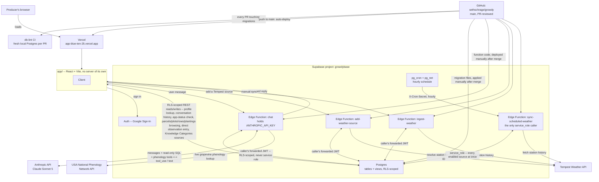
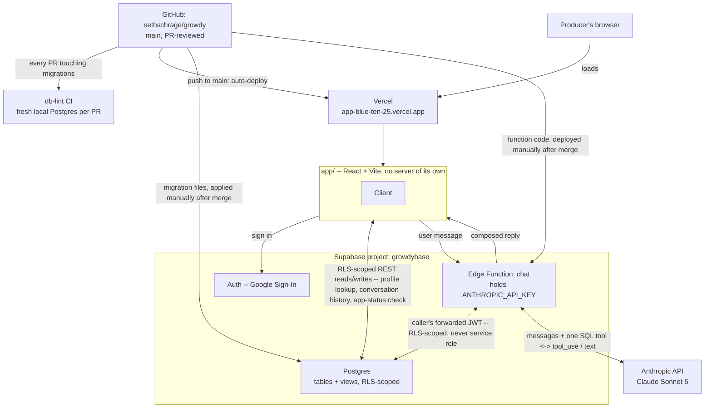
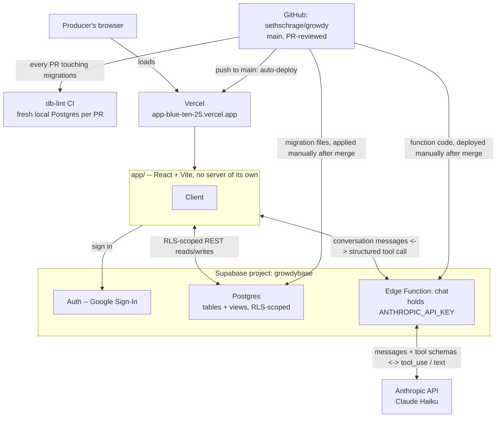

# Architecture

Where the pieces actually run and how they talk to each other. This
complements [`docs/data-model.md`](data-model.md) (the shape of the data)
and [`docs/decisions/`](decisions) (why each piece exists) with the one
view neither gives on its own: what's deployed where, and what deploys
itself versus what has to be deployed on purpose.

```mermaid
flowchart TD
    GH["GitHub: sethschrage/growdy<br/>main, PR-reviewed"]
    CI["db-lint CI<br/>fresh local Postgres per PR"]
    Vercel["Vercel<br/>app-blue-ten-25.vercel.app"]
    Browser["Producer's browser"]
    PublicViewer["Signed-out visitor<br/>with a shared link"]

    GH -->|every PR touching migrations| CI
    GH -->|"push to main: auto-deploy"| Vercel
    Browser -->|loads| Vercel
    PublicViewer -->|"/a/:id, no sign-in"| Vercel

    subgraph App["app/ -- React + Vite, no server of its own"]
        Client["Client"]
    end
    Vercel --> App

    subgraph Supabase["Supabase project: growdybase"]
        Auth["Auth -- Google Sign-In"]
        DB["Postgres<br/>tables + views, RLS-scoped"]
        Cron["pg_cron + pg_net<br/>1 hourly + 2 six-hourly schedules"]
        ChatFn["Edge Function: chat<br/>holds ANTHROPIC_API_KEY, VOYAGE_API_KEY"]
        AddWeatherFn["Edge Function: add-weather-source"]
        IngestFn["Edge Function: ingest-weather"]
        SyncFn["Edge Function: sync-scheduled-weather"]
        ScanFn["Edge Function: scan-conversations-for-observations"]
        EmbedFn["Edge Function: embed-scheduled-memory"]
    end

    GH -->|"migration files, applied manually after merge"| DB
    GH -->|"function code, deployed manually after merge"| ChatFn
    GH --> AddWeatherFn
    GH --> IngestFn
    GH --> SyncFn
    GH --> ScanFn
    GH --> EmbedFn

    App -->|sign in| Auth
    App <-->|"RLS-scoped REST reads/writes -- profile lookup, conversation history, app-status check, parcels/plots/rows/plantings browsing, direct observation entry, Knowledge Categories sources, artifact share/delete"| DB
    PublicViewer -->|"get_public_artifact(id) -- the one anon-reachable RPC, see 0027"| DB
    App -->|"user message"| ChatFn
    ChatFn -->|"composed reply"| App
    ChatFn <-->|"caller's forwarded JWT -- RLS-scoped, never service role"| DB
    ChatFn <-->|"messages + read-only SQL + write proposals + memory search + phenology + web access tools <-> tool_use / text"| Anthropic["Anthropic API<br/>Claude Sonnet 5"]
    ChatFn -->|"live grapevine phenology lookup"| USANPN["USA National Phenology<br/>Network API"]
    ChatFn -->|"embed a search query"| Voyage["Voyage AI (via MongoDB)<br/>embeddings API"]
    App -->|"add a Tempest source"| AddWeatherFn
    AddWeatherFn <-->|"caller's forwarded JWT"| DB
    AddWeatherFn -->|"resolve station ID -> device ID"| Tempest["Tempest Weather API"]
    App -->|"manual sync"| IngestFn
    IngestFn <-->|"caller's forwarded JWT"| DB
    IngestFn -->|"fetch station history"| Tempest
    Cron -->|"X-Cron-Secret, hourly"| SyncFn
    SyncFn <-->|"service_role -- every enabled source at once"| DB
    SyncFn -->|"fetch station history"| Tempest
    Cron -->|"X-Cron-Secret, every 6h"| ScanFn
    ScanFn <-->|"service_role -- every unscanned conversation"| DB
    ScanFn -->|"classify transcript -> candidate observations"| Anthropic
    Cron -->|"X-Cron-Secret, every 6h"| EmbedFn
    EmbedFn <-->|"service_role -- every unembedded row"| DB
    EmbedFn -->|"embed memory entries + conversation chunks"| Voyage
```

## Reading this diagram

- **Three deploy paths, three different amounts of automation.** Vercel
  is connected straight to GitHub and deploys the app on every push to
  `main` with no manual step -- see
  [`docs/decisions/0008`](decisions/0008-app-as-research-tool.md). A
  migration or an Edge Function change is the opposite: written and
  reviewed in a PR, then applied or deployed to Supabase by hand, only
  after that PR merges, never before -- see
  [`CONTRIBUTING.md`](../CONTRIBUTING.md). Both are correct for what they
  are: the app has no secrets and nothing to lose by shipping instantly;
  Supabase holds real producer data and the only API key this project
  has, so nothing reaches it without a human merging first.
- **Six Edge Functions now, not one**, each scoped to exactly what it
  needs: `chat`, `ingest-weather`, and `add-weather-source` all build
  their own per-request Postgres client from the caller's forwarded JWT,
  never the service role key, so every query they run is RLS-scoped
  exactly as if the browser ran it directly (see
  [`docs/decisions/0016`](decisions/0016-chat-queries-directly.md) and
  the comment at the top of
  [`supabase/functions/_shared/supabaseClient.ts`](../supabase/functions/_shared/supabaseClient.ts)).
  `sync-scheduled-weather` was once the one deliberate exception; it's
  now one of three `service_role` callers, alongside
  `scan-conversations-for-observations` and `embed-scheduled-memory` --
  all three exist for the identical reason, nobody is signed in when
  `pg_cron` fires them, and all three verify a Vault-stored
  `X-Cron-Secret` before doing anything, the one deliberately narrow,
  cross-producer exception this project allows (see
  [`docs/decisions/0020`](decisions/0020-scheduled-weather-sync.md)).
- **Four external APIs now, not one.** Alongside Anthropic, `chat` also
  calls the USA National Phenology Network's public API directly, live,
  per question -- no ingestion, nothing stored locally, since it's a
  shared dataset queried at chat-time rather than a per-producer feed
  (see [`docs/decisions/0019`](decisions/0019-external-data-channels.md)'s
  prediction that a future source would need a genuinely different
  shape). Tempest is called from three different places for two different
  reasons: `add-weather-source` resolves a producer-entered station ID to
  the device ID Tempest's observations endpoint actually requires,
  `ingest-weather` backfills/refreshes on a producer's own manual action,
  and `sync-scheduled-weather` does the same on `pg_cron`'s hourly clock
  -- but the actual fetch/parse/validate/upsert logic lives once, in
  `_shared/weatherIngest.ts`, not duplicated across the two ingestion
  paths. Voyage AI (via MongoDB, since its 2024 acquisition) is the
  newest -- called from `chat` to embed a search query live, and from
  `embed-scheduled-memory` to embed memory entries/conversation chunks on
  its own 6-hourly clock, both through the same `_shared/voyage.ts` (see
  [`docs/decisions/0023`](decisions/0023-producer-memory-via-embeddings.md)).
- **The app has one signed-out-reachable surface now.** A shared artifact
  link (`/a/:id`) calls `get_public_artifact(id)` directly from the
  browser -- no Edge Function, no session -- the first and only place
  `anon` can reach Postgres at all, deliberately a narrow function lookup
  by exact id rather than an RLS grant to `anon` (a table grant could be
  turned into a listable collection; a function can't) -- see
  [`docs/decisions/0027`](decisions/0027-public-artifact-links.md).
- **The app's own direct connection to the database covers more ground
  than it used to** -- auth, the producer-id lookup, conversation-history
  logging (`docs/decisions/0011`), the `app_status` poll
  (`docs/decisions/0017`), Knowledge Categories' source management, and
  now the sprout menu's two features: browsing the producer's own
  parcel/plot/row/planting structure read-only, and entering a structured
  observation directly -- both deliberately outside the chat/model path
  entirely, going straight to Postgres under the producer's own RLS
  session. Every actual *question* about vineyard data still goes through
  `chat`, which writes and runs its own SQL against Postgres rather than
  the client resolving a fixed set of query shapes.
- **Supabase Storage isn't in this diagram.** It's listed in
  `README.md`'s stack table as a future concern for photo attachments,
  but no bucket exists yet and nothing in the app uses it --
  deliberately deferred, see
  [`docs/decisions/0009`](decisions/0009-chat-based-observation-submission.md).
- **CI is independent of every deploy path.** `db-lint` runs against a
  disposable local Postgres on every PR that touches a migration; it
  never touches the live `growdybase` project either way.
- **Every open tab also polls one small status check** -- a build-time
  version stamp plus a manually-toggleable `app_status.maintenance`
  flag -- and hard-blocks itself if either says something changed that
  it doesn't know about yet: a newer deploy, or a maintenance window
  flipped on before risky direct work against production. See
  [`docs/decisions/0017`](decisions/0017-app-status-forces-refresh.md).
- **A fourth surface exists outside this diagram entirely**: a Claude
  Code Remote session and a claude.ai Artifact dashboard, watching
  `growdybase` and Vercel and pushing a phone notification when
  something needs attention. It isn't drawn here because it isn't part
  of growdy's own deploy paths (nothing about it lives in this repo's
  CI, Supabase, or Vercel) -- see
  [`docs/monitoring.md`](monitoring.md#8-the-live-dashboard-and-scheduled-check----and-where-it-actually-lives)
  for exactly where it runs and its one real fragility.

## History

### 2026-09-17 -- before producer memory, conversation scanning, public artifacts, and the write tool ([0022](decisions/0022-chat-writes-data-with-audit-and-rollback.md), [0023](decisions/0023-producer-memory-via-embeddings.md), [0025](decisions/0025-parcel-sharing-and-self-serve-creation.md) follow-up, [0027](decisions/0027-public-artifact-links.md))

This diagram had fallen behind several real, already-shipped changes at
once, not just one -- caught while updating it for today's write-tool
work rather than let it drift further. The diagram above gained two
Edge Functions (`scan-conversations-for-observations`,
`embed-scheduled-memory`), a second and third `service_role` caller, a
fourth external API (Voyage AI), and the app's first signed-out-reachable
surface (`get_public_artifact`). Before all of that, it was:

### 2026-09-15 -- before external data channels and scheduled sync ([0019](decisions/0019-external-data-channels.md), [0020](decisions/0020-scheduled-weather-sync.md))

The diagram above gained three Edge Functions (`add-weather-source`,
`ingest-weather`, `sync-scheduled-weather`), `pg_cron`/`pg_net`, and two
external APIs (Tempest, USA National Phenology Network). Before that, the
whole system had exactly one Edge Function and one external API:

### Before 0016: client resolves, Edge Function never touches the database

The chat's shape changed materially in `0016` -- worth keeping the
prior diagram visible rather than only in `git log -p`, per this file's
own convention.

### Before 0016: client resolves, Edge Function never touches the database

The Edge Function's only job was one round trip to Anthropic: take the
conversation, return either a question or a structured tool call
(`variety_lookup`, `parcel_lookup`, `planting_lookup`, `position_status`,
or `submit_observation_draft`). Every actual read or write against
Postgres happened from the client, under the signed-in producer's own
RLS-scoped session -- the double arrow between the app and the Edge
Function was the tool-use round trip itself: the app resolved a fixed
query shape or an observation draft, then sent the result back so the
model could compose the reply (`docs/decisions/0010`, `0013`).
