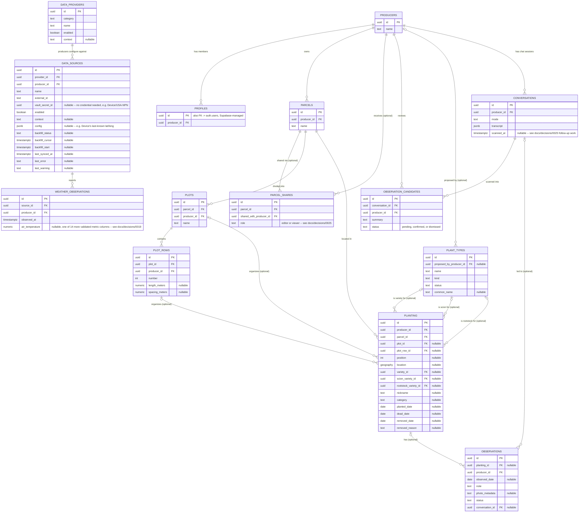
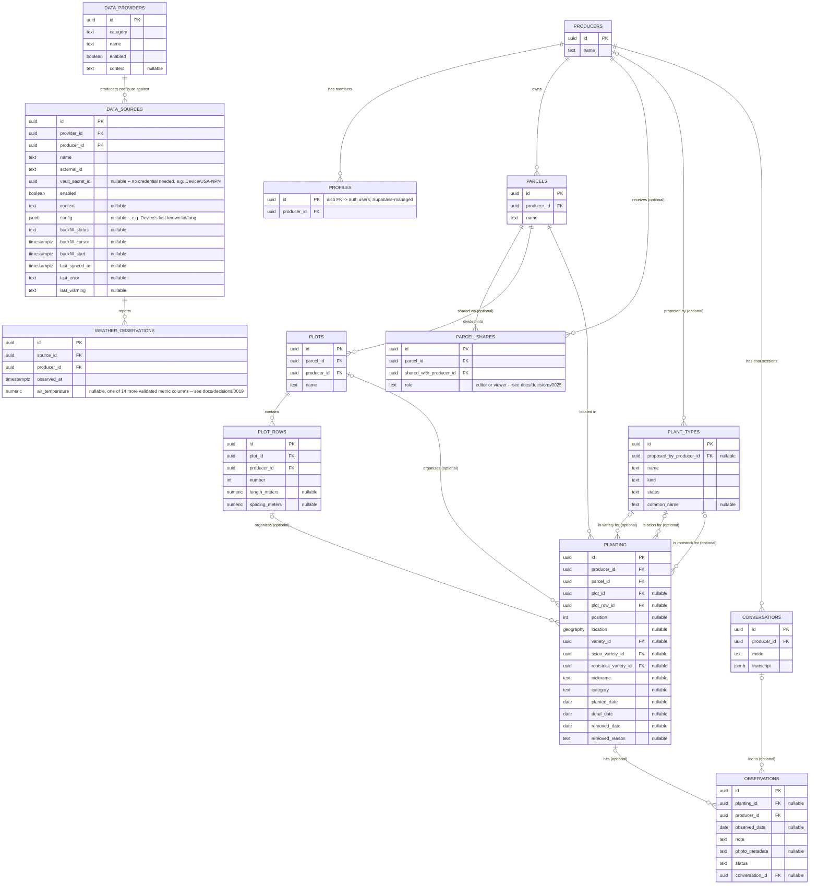
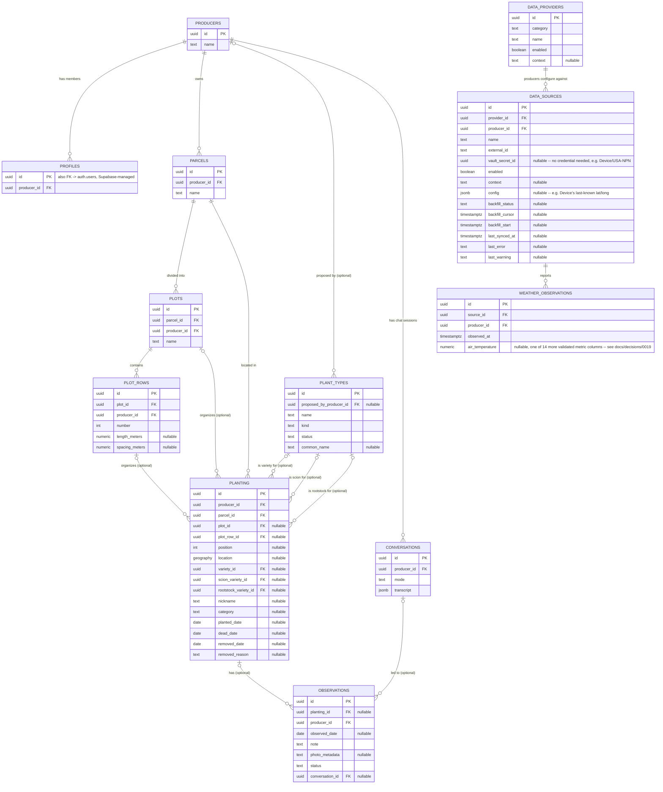
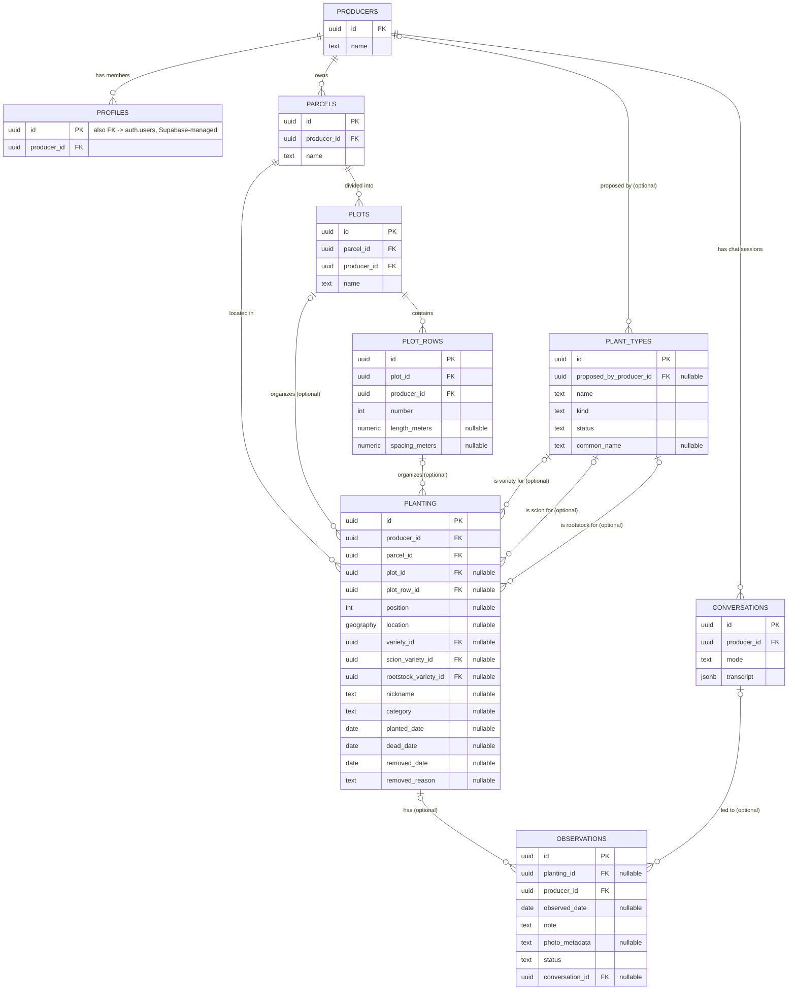

# Data model

The full set of tables and how they relate. This complements
[`docs/decisions/`](decisions) rather than duplicating it: this page shows
the *structure*; the ADRs explain *why* specific choices within it were
made.

## Reading this diagram

- **The hierarchy** (`producers > parcels > plots > plot_rows > planting`)
  is the backbone. `parcel_id` on `planting` is always required; `plot_id`
  and `plot_row_id` are only set for organized (gridded) plantings --
  see [0002](decisions/0002-planting-location-model.md).
- **`plant_types` is the one table that isn't producer-scoped.** It's a
  shared, global vocabulary -- `planting` references it three separate
  ways (`variety_id`, `scion_variety_id`, `rootstock_variety_id`)
  depending on whether a plant is own-rooted or grafted -- see
  [0004](decisions/0004-plant-types-kind-and-planting-columns.md).
  `name` for a `kind = 'scion'` row is often a formal certified clone
  identifier, not a grape variety name -- `common_name` (nullable) holds
  the actual variety where it's known, distinct from `planting.nickname`,
  which is a per-planting informal label, not a shared reference -- see
  [0018](decisions/0018-plant-types-common-name.md).
- **`producer_id` is denormalized onto every table below `producers`**
  (not just reachable by joining up the chain), so RLS policies never
  need to walk the hierarchy to check access -- see
  [0001](decisions/0001-tenancy-membership-model.md). Those redundant
  `producer_id` columns exist on every table but aren't drawn as separate
  relationship lines here, to keep the diagram legible.
- **`position_status`** and **`planting_readable`** (views, not tables --
  see [0006](decisions/0006-planting-lifecycle-and-position-status.md))
  aren't shown above since they have no stored columns of their own;
  they're derived reads over `planting` and related tables.
- **`data_providers`/`data_sources` aren't weather-specific**, even though
  `weather_observations` is the only table either currently feeds. The
  same `category`/`provider`/`source` rows also cover `location` (the
  `Device` provider, a producer's own GPS reading, no credential and
  `vault_secret_id` left null) and `phenology` (USA National Phenology
  Network, a shared public dataset queried live rather than ingested --
  it has no observations table of its own, since nothing is stored
  locally). `config` (jsonb) is where a source that isn't ingesting
  time-series data keeps whatever it needs instead -- `Device`'s last
  known latitude/longitude, currently the only user.
- **`observations.status`** defaults to `pending` and only becomes
  `approved`/`rejected` after review. Chat-based submission (originally
  [0009](decisions/0009-chat-based-observation-submission.md)) is removed
  as of [0016](decisions/0016-chat-queries-directly.md), but the same
  gate now applies to a producer entering an observation directly through
  a structured form in the app (`app/src/ObservationForm.tsx`) -- outside
  the chat/model path entirely, writing straight to this table under the
  producer's own RLS session.
- **`observations.planting_id` is nullable** -- a note doesn't have to be
  about one specific plant; a general one (a task done, something seen,
  not tied to a position) is logged with no planting at all -- see
  [0014](decisions/0014-open-ended-observations.md). Still true of the
  table even though the chat-submission flow that originally motivated
  it is gone.
- **`conversations`** is one row per chat session, holding the full
  message transcript -- see [0011](decisions/0011-conversation-history.md).
  `mode` is always `ask` now that chat-based submission is removed
  ([0016](decisions/0016-chat-queries-directly.md)); one historical row
  from before that change still reads `submit`. `observations.conversation_id`
  points back to the session a submission came from, for observations
  submitted through the chat before it was removed; review follows that
  link to see the full exchange instead of a transcript duplicated onto
  the observation row itself.
- `auth.users` (Supabase-managed, not part of this project's own schema)
  isn't drawn as a full entity, but `profiles.id` is a foreign key into it.
- **`parcel_shares` grants access to one specific parcel, not a whole
  producer account** -- see [0025](decisions/0025-parcel-sharing-and-self-serve-creation.md).
  There's no `'owner'` value in its `role` column; the real owner is
  `parcels.producer_id` itself, unchanged. Access cascades down through
  `plots`, `plot_rows`, and `planting` (all reachable from a parcel), but
  only reaches an `observations` row when it's tied to a `planting` under
  that parcel -- a general observation with no `planting_id` stays
  visible only to the owning producer.
- **`observation_candidates` is a review queue, not a second submission
  path** -- a scheduled job (0025 follow-up work) reads conversations with
  `scanned_at` null or stale against `updated_at`, asks Claude whether
  each one describes a real field observation, and inserts a candidate
  only on a positive match. A producer can only update its `status` (to
  `confirmed` or `dismissed`) and `reviewed_at`; confirming inserts a
  normal `observations` row through the app itself (still `status =
  'pending'`, same review gate every observation goes through) rather
  than this table writing to `observations` directly.

## History

### 2026-09-16 -- before observation candidates ([0025](decisions/0025-parcel-sharing-and-self-serve-creation.md) follow-up work)

The diagram above gained `conversations.scanned_at` and `observation_candidates`. Before that, it was:

### 2026-09-16 -- before parcel sharing ([0025](decisions/0025-parcel-sharing-and-self-serve-creation.md))

The diagram above gained `parcel_shares`. Before that, it was:

### 2026-09-15 -- before external data channels ([0019](decisions/0019-external-data-channels.md))

The diagram above gained `data_providers`, `data_sources`, and
`weather_observations`. Before that, it was:

