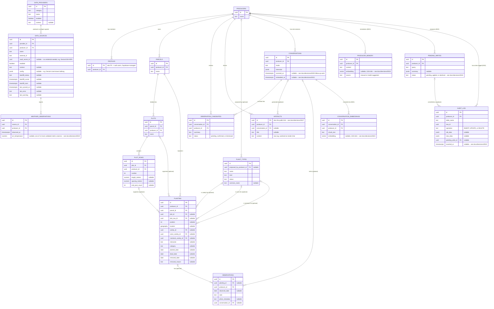
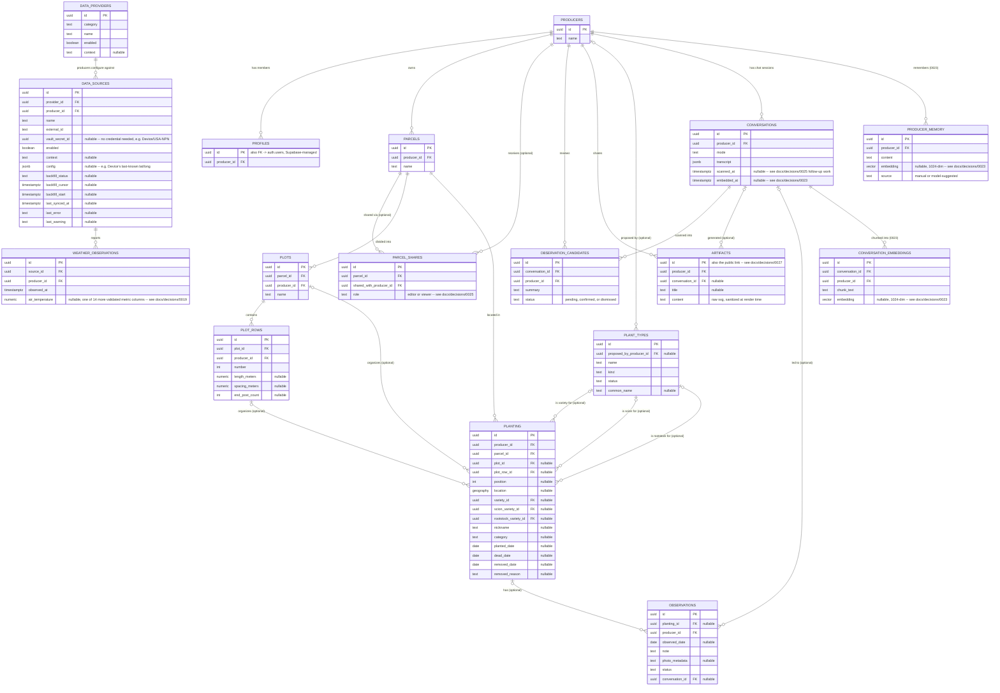
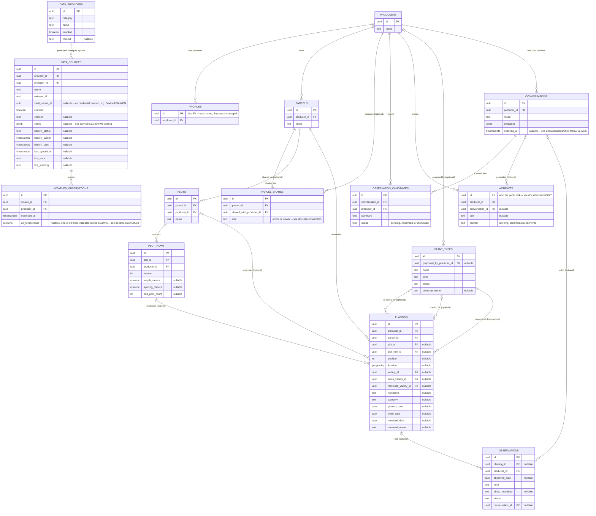
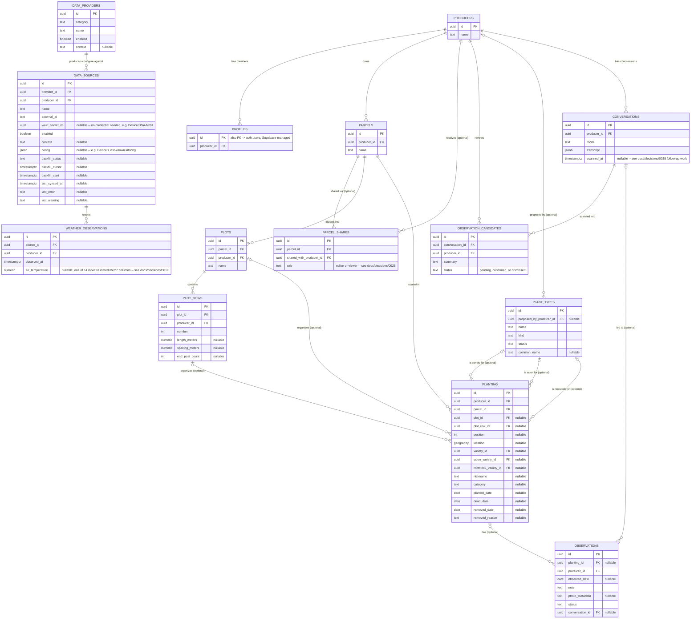
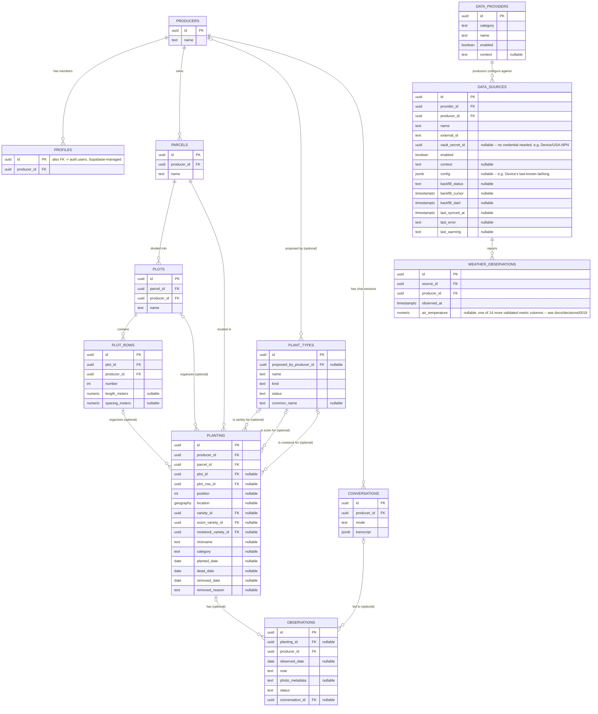
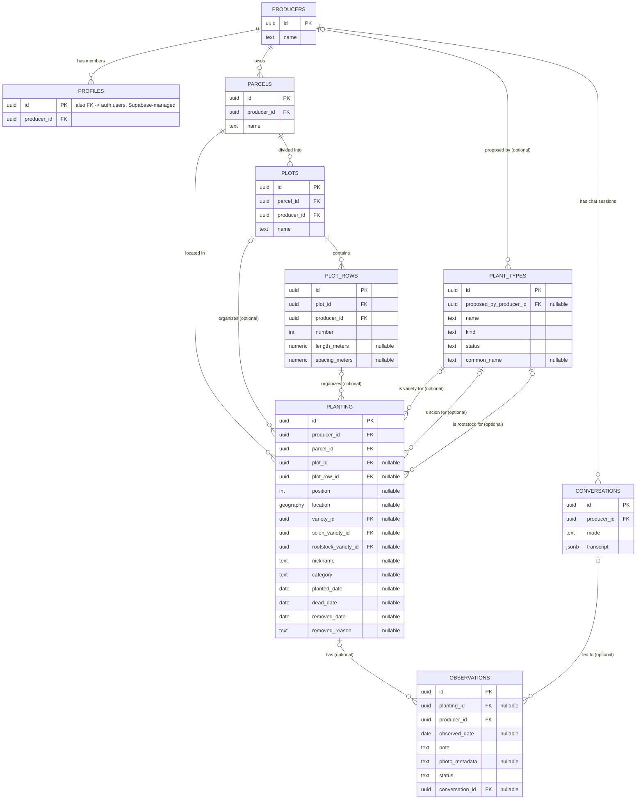

# Data model

The full set of tables and how they relate. This complements
[`docs/decisions/`](decisions) rather than duplicating it: this page shows
the *structure*; the ADRs explain *why* specific choices within it were
made.

```mermaid
erDiagram
    PRODUCERS {
        uuid id PK
        text name
    }
    PROFILES {
        uuid id PK "also FK -> auth.users, Supabase-managed"
        uuid producer_id FK
    }
    PARCELS {
        uuid id PK
        uuid producer_id FK
        text name
    }
    PLOTS {
        uuid id PK
        uuid parcel_id FK
        uuid producer_id FK
        text name
    }
    PLOT_ROWS {
        uuid id PK
        uuid plot_id FK
        uuid producer_id FK
        int number
        numeric length_meters "nullable"
        numeric spacing_meters "nullable"
        int end_post_count "nullable"
    }
    PLANTING {
        uuid id PK
        uuid producer_id FK
        uuid parcel_id FK
        uuid plot_id FK "nullable"
        uuid plot_row_id FK "nullable"
        int position "nullable"
        geography location "nullable"
        uuid variety_id FK "nullable"
        uuid scion_variety_id FK "nullable"
        uuid rootstock_variety_id FK "nullable"
        text nickname "nullable"
        text category "nullable"
        date planted_date "nullable"
        date dead_date "nullable"
        date removed_date "nullable"
        text removed_reason "nullable"
    }
    PLANT_TYPES {
        uuid id PK
        uuid proposed_by_producer_id FK "nullable"
        text name
        text kind
        text status
        text common_name "nullable"
    }
    OBSERVATIONS {
        uuid id PK
        uuid planting_id FK "nullable -- what the note is about"
        uuid producer_id FK
        date observed_date "nullable"
        text note
        text photo_metadata "nullable -- storage path, named before it held one"
        geography photo_location "nullable -- where the camera was, see docs/decisions/0030"
        real photo_location_accuracy_m "nullable"
        uuid conversation_id FK "nullable"
    }
    CONVERSATIONS {
        uuid id PK
        uuid producer_id FK
        text mode
        jsonb transcript
        timestamptz scanned_at "nullable -- see docs/decisions/0025 follow-up work"
        timestamptz embedded_at "nullable -- see docs/decisions/0023"
    }
    OBSERVATION_CANDIDATES {
        uuid id PK
        uuid conversation_id FK "nullable -- a typed note has no conversation"
        uuid producer_id FK
        text summary
        text note "nullable"
        date observed_date "nullable"
        uuid planting_id FK "nullable"
        text photo_path "nullable -- observation-photos bucket"
        geography photo_location "nullable -- where the camera was"
        real photo_location_accuracy_m "nullable"
        text source "chat_scan, photo, producer, or chat_tool"
        text status "pending, confirmed, or dismissed"
        timestamptz reviewed_at "nullable"
        uuid client_id "nullable, globally unique -- minted on the device before the server ever saw it"
    }
    DATA_PROVIDERS {
        uuid id PK
        text category
        text name
        boolean enabled
        text context "nullable"
    }
    DATA_SOURCES {
        uuid id PK
        uuid provider_id FK
        uuid producer_id FK
        text name
        text external_id
        uuid vault_secret_id "nullable -- no credential needed, e.g. Device/USA-NPN"
        boolean enabled
        text context "nullable"
        jsonb config "nullable -- e.g. Device's last-known lat/long"
        text backfill_status "nullable"
        timestamptz backfill_cursor "nullable"
        timestamptz backfill_start "nullable"
        timestamptz last_synced_at "nullable"
        text last_error "nullable"
        text last_warning "nullable"
    }
    WEATHER_OBSERVATIONS {
        uuid id PK
        uuid source_id FK
        uuid producer_id FK
        timestamptz observed_at
        numeric air_temperature "nullable, one of 14 more validated metric columns -- see docs/decisions/0019"
    }
    PRODUCER_MEMORY {
        uuid id PK
        uuid producer_id FK
        text content
        vector embedding "nullable, 1024-dim -- see docs/decisions/0023"
        text source "manual or model-suggested"
    }
    CONVERSATION_EMBEDDINGS {
        uuid id PK
        uuid conversation_id FK
        uuid producer_id FK
        text chunk_text
        vector embedding "nullable, 1024-dim -- see docs/decisions/0023"
    }
    PENDING_WRITES {
        uuid id PK
        uuid producer_id FK
        text query
        jsonb summary "nullable"
        text status "pending, applied, or declined -- see docs/decisions/0022"
    }
    AUDIT_LOG {
        uuid id PK
        uuid producer_id FK
        text table_name
        uuid row_id
        text operation "INSERT, UPDATE, or DELETE"
        jsonb old_data "nullable"
        jsonb new_data "nullable"
        uuid pending_write_id FK "nullable"
        timestamptz reverted_at "nullable -- see docs/decisions/0022"
    }
    APP_STATUS {
        boolean id PK "CHECK (id) plus the primary key: exactly one row can ever exist"
        boolean maintenance "hard-blocks every open tab when true"
        text message "nullable -- shown on the block screen"
    }

    ARTIFACTS_DEPRECATED {
        uuid id PK "dead -- nothing reads this table"
        uuid producer_id FK "the producer the saved graphic belonged to"
        uuid conversation_id FK "the chat turn it came out of"
        text title "nullable -- neither surviving row has one"
        text content "the SVG the model wrote"
    }

    PRODUCERS ||--o{ PROFILES : "has members"
    PRODUCERS ||--o{ PARCELS : owns
    PRODUCERS ||--o{ OBSERVATION_CANDIDATES : "reviews"
    CONVERSATIONS ||--o{ OBSERVATION_CANDIDATES : "scanned into"
    PARCELS ||--o{ PLOTS : "divided into"
    PLOTS ||--o{ PLOT_ROWS : contains
    PARCELS ||--o{ PLANTING : "located in"
    PLOTS |o--o{ PLANTING : "organizes (optional)"
    PLOT_ROWS |o--o{ PLANTING : "organizes (optional)"
    PLANTING |o--o{ OBSERVATIONS : "has (optional)"
    PLANT_TYPES |o--o{ PLANTING : "is variety for (optional)"
    PLANT_TYPES |o--o{ PLANTING : "is scion for (optional)"
    PLANT_TYPES |o--o{ PLANTING : "is rootstock for (optional)"
    PRODUCERS |o--o{ PLANT_TYPES : "proposed by (optional)"
    PRODUCERS ||--o{ CONVERSATIONS : "has chat sessions"
    CONVERSATIONS |o--o{ OBSERVATIONS : "led to (optional)"
    DATA_PROVIDERS ||--o{ DATA_SOURCES : "producers configure against"
    DATA_SOURCES ||--o{ WEATHER_OBSERVATIONS : reports
    PRODUCERS ||--o{ PRODUCER_MEMORY : "remembers (0023)"
    CONVERSATIONS ||--o{ CONVERSATION_EMBEDDINGS : "chunked into (0023)"
    PRODUCERS ||--o{ PENDING_WRITES : "proposes (0022)"
    PRODUCERS ||--o{ AUDIT_LOG : "has writes logged (0022)"
    PENDING_WRITES |o--o{ AUDIT_LOG : "committed as (optional)"
```

A note on `ARTIFACTS_DEPRECATED`, because a tombstone in a diagram
invites the question. The artifacts feature -- the model drawing an SVG
inline in a reply, the producer saving it, and a `/a/<id>` page a
signed-out browser could open -- was removed entirely, and `0027` is
withdrawn. The table is drawn here only because it still exists, and it
still exists because [`CONTRIBUTING.md`](../CONTRIBUTING.md) requires a
migration that would destroy real data to rename rather than drop, with
the actual drop left for its own later migration. Nothing reads it, and
it holds two untitled records from the week the feature was built. It
goes in a migration of its own, and this block goes with it.

That migration has not been written yet. Until it lands the table is
not inert: the rename carried its grants, its three `artifacts: member
can ...` policies and its `audit_row_change` trigger across with it, so
"nothing reads it" is a fact about the clients rather than about the
schema: `authenticated` still holds `select`, `insert`, `delete` and
`truncate` on it. `chat` hides it from the model's prompt, but
`propose_write_query` takes free-form SQL, so the write path is open
even though the description is not. [`docs/monitoring.md`](monitoring.md)
carries both halves as an open item, because a rename window nobody is
counting does not end on its own.

## Reading this diagram

- **The hierarchy** (`producers > parcels > plots > plot_rows > planting`)
  is the backbone. `parcel_id` on `planting` is always required; `plot_id`
  and `plot_row_id` are only set for organized (gridded) plantings --
  see [0002](decisions/0002-planting-location-model.md).
- **`plot_rows`' three measurement columns (`length_meters`,
  `spacing_meters`, `end_post_count`) had no write path at all until
  recently** -- `authenticated` held `SELECT` only, so no form was ever
  built for them despite `length_meters`/`spacing_meters` existing since
  early on. A column-scoped `UPDATE` grant opened the first real write
  path, and the tree view's row nodes got their first inline edit form to
  use it. The policy beside that grant took two goes: it reused
  `private.user_can_edit_parcel`, which queried `parcel_shares`, and
  [0028](decisions/0028-what-uat-removed.md) dropped that table out from
  under it -- so every measurement update failed with "relation
  parcel_shares does not exist" for two days, and nothing reported it
  (see [`docs/monitoring.md`](monitoring.md)).
  [0036](decisions/0036-rls-predicates-are-evaluated-once.md) dropped the
  function and rewrote the policy the way the rest of the schema now
  reads -- "`plot_rows`: member can update their producer's rows",
  resolving the row's plot up to a parcel whose `producer_id` is
  `(select private.current_producer_id())`. There is no editor/owner
  distinction left to draw: [0028](decisions/0028-what-uat-removed.md)
  removed sharing, so an editor is just the owner.
- **`plant_types` is the one table that isn't producer-scoped.** It's a
  shared, global vocabulary -- `planting` references it three separate
  ways (`variety_id`, `scion_variety_id`, `rootstock_variety_id`)
  depending on whether a plant is own-rooted or grafted -- see
  [0004](decisions/0004-plant-types-kind-and-planting-columns.md).
  `name` for a `kind = 'scion'` row is often a formal certified clone
  identifier, not a grape variety name -- `common_name` (nullable) holds
  the actual variety where it's known, distinct from `planting.nickname`,
  which is a per-planting informal label, not a shared reference -- see
  [0018](decisions/0018-plant-types-common-name.md).
- **`producer_id` is denormalized onto every table below `producers`**
  (not just reachable by joining up the chain), so RLS policies never
  need to walk the hierarchy to check access -- see
  [0001](decisions/0001-tenancy-membership-model.md). Those redundant
  `producer_id` columns exist on every table but aren't drawn as separate
  relationship lines here, to keep the diagram legible.
- **`position_status`** and **`planting_readable`** (views, not tables --
  see [0006](decisions/0006-planting-lifecycle-and-position-status.md))
  aren't shown above since they have no stored columns of their own;
  they're derived reads over `planting` and related tables.
- **`data_providers`/`data_sources` aren't weather-specific**, even though
  `weather_observations` is the only table either currently feeds. The
  same `category`/`provider`/`source` rows also cover `location` (the
  `Device` provider, a producer's own GPS reading, no credential and
  `vault_secret_id` left null) and `phenology` (USA National Phenology
  Network, a shared public dataset queried live rather than ingested --
  it has no observations table of its own, since nothing is stored
  locally). `config` (jsonb) is where a source that isn't ingesting
  time-series data keeps whatever it needs instead -- `Device`'s last
  known latitude/longitude, currently the only user.
- **`observations` has no review column any more** -- see
  [0028](decisions/0028-what-uat-removed.md). A `status` column gated
  every observation behind `pending` until a human approved it, and it
  was removed because nothing could ever do the approving: there was no
  `UPDATE` grant or policy, so a chat-logged note would have sat pending
  forever. An observation now counts as data the moment it is written,
  and a producer deletes what they don't want from the observation log
  (`app/src/features/observations/ObservationLogView.tsx`). That is safe because `audit_log`
  keeps the whole deleted row (see `audit_row_change()` below), so the
  correction is reversible in a way "never approved" never was. Review
  is back in front of that, though not on this table --
  [0030](decisions/0030-every-observation-through-one-queue.md) makes
  `observation_candidates` the only way in, so deletion is the
  correction *after* approval rather than instead of it. All four paths
  that used to insert directly now file a candidate instead: the
  structured form (`app/src/features/observations/ObservationForm.tsx`), the "Log this
  observation" button a chat reply can offer, 0022's write tool, and the
  6-hourly scanner. `authenticated` no longer holds an `INSERT` grant at
  all; the only remaining writer is `confirm_observation_candidate`,
  which is `security definer` and runs after a producer has looked at
  the row.
- **`observations.planting_id` is nullable** -- a note doesn't have to be
  about one specific plant; a general one (a task done, something seen,
  not tied to a position) is logged with no planting at all -- see
  [0014](decisions/0014-open-ended-observations.md). Still true of the
  table even though the chat-submission flow that originally motivated
  it is gone.
- **`conversations`** is one row per chat session, holding the full
  message transcript -- see [0011](decisions/0011-conversation-history.md).
  `mode` is always `ask` now that chat-based submission is removed
  ([0016](decisions/0016-chat-queries-directly.md)); one historical row
  from before that change still reads `submit`. `observations.conversation_id`
  points back to the session a submission came from, for observations
  submitted through the chat before it was removed; review follows that
  link to see the full exchange instead of a transcript duplicated onto
  the observation row itself.
- `auth.users` (Supabase-managed, not part of this project's own schema)
  isn't drawn as a full entity, but `profiles.id` is a foreign key into it.
- **`parcels` is the billable seat, and nothing in the app creates one**
  -- `authenticated` holds no `INSERT` grant and there is no insert
  policy, so a parcel is created for a producer by hand (later, by a
  purchase flow). Both the sharing and the self-serve-creation halves of
  [0025](decisions/0025-parcel-sharing-and-self-serve-creation.md) were
  removed by [0028](decisions/0028-what-uat-removed.md) for the same
  reason: a seat you can give away, or mint for free, isn't a seat.
- **There is no sharing table** -- `parcel_shares` was dropped by
  [0028](decisions/0028-what-uat-removed.md), because parcels are what
  Growdy sells and the parcel is the seat, so handing one to another
  producer undercuts the thing being charged for. Access to everything
  under a parcel therefore resolves through `parcels.producer_id` alone,
  which is the plain tenancy rule
  [0001](decisions/0001-tenancy-membership-model.md) started with.
- **`observation_candidates` is the only submission path** --
  it began as a review queue for one source: a scheduled job reads
  conversations with `scanned_at` null or stale against `updated_at`,
  asks Claude whether each describes a real field observation, and
  inserts a candidate on a positive match.
  [0030](decisions/0030-every-observation-through-one-queue.md) widened it
  to every source, and closed it: `authenticated` holds no `INSERT`
  grant on `observations` any more. `conversation_id` is nullable (a typed note has no
  conversation behind it), `note`, `observed_date`, `planting_id` and
  `photo_path` sit alongside `summary` so confirming builds a whole
  observation rather than copying a one-line summary, and `source`
  records which path proposed the row (`chat_scan`, `photo`, `producer`,
  `chat_tool`) because that is what decides how much scrutiny it
  deserves at review. Its `status` column is unrelated to the one
  `observations` used to have and survives 0028 -- the difference 0028
  cared about is that this queue has a real actor who can reach it.
- **A photo is a path, not a column.** The bytes live in the private
  `observation-photos` bucket; `observation_candidates.photo_path` and
  `observations.photo_metadata` hold `<producer_id>/<uuid>.jpg` into it.
  `photo_metadata` is named for what [`0009`](decisions/0009-chat-based-observation-submission.md)
  reserved rather than what it now holds. Tenancy is the path itself:
  `storage.objects` has no producer column, so its RLS policies read the
  first segment through `private.storage_object_producer()`. Nothing is
  public -- every read mints a short signed URL.
- **`photo_location` is where the camera was; `planting_id` is what the
  photo is about.** They are separate on purpose. Most photos never get
  a planting attached -- weed pressure across a block, standing water,
  something odd at the fence line -- and for those the point is the only
  spatial fact that will ever exist. A `geography(Point, 4326)`, so it
  can be asked spatial questions when there is a map to ask them on.
- **`confirm_observation_candidate()` is how a candidate becomes an
  observation**, replacing two client statements that inserted the
  observation and then marked the candidate with nothing holding them
  together -- a failure in between left a confirmed-but-still-pending
  candidate, so confirming again duplicated the row. It is idempotent on
  anything not `pending`. `create_observation_candidate()` is the mirror
  image, taking the producer from the caller's profile rather than an
  argument so a caller cannot file against somebody else's producer. Its
  eleventh argument, `p_client_id`, is what makes the offline queue
  ([0037](decisions/0037-what-happens-with-no-signal.md)) safe to retry:
  a candidate whose client id is already filed returns that row's id and
  inserts nothing, so a flush interrupted half way costs a duplicate
  request rather than a duplicate observation. It returns the id either
  way rather than quietly doing nothing, because a caller that cannot
  tell a successful replay from a failure will keep trying forever. The
  lookup is scoped to the caller's producer as well as the id, so a
  stray id can never hand back somebody else's row.
- **`pending_writes` and `audit_log` back the chat's write tool** -- see
  [0022](decisions/0022-chat-writes-data-with-audit-and-rollback.md).
  `pending_writes` is a proposed DML statement (already dry-run
  validated) waiting on a real confirm/decline click; `audit_log` is a
  before/after `jsonb` snapshot of every write actually committed,
  written only by the generic `audit_row_change()` trigger, never by a
  producer directly (`parcel_shares` had a dedicated one of its own,
  removed with the table by 0028).
  `audit_log.pending_write_id` is nullable because not every audited
  write started as a chat proposal -- a handful of rows predate this
  mechanism, from direct maintainer SQL against a table the trigger is
  attached to. Both tables were live from 0022's first migration but
  missing from this diagram until now -- a real gap, not a deliberate
  omission like the derived views below. `audit_log.table_name` can
  also name a table no query will find today (`parcel_shares`, dropped;
  `artifacts`, renamed out from under those rows): the log records what
  happened, so an entry naming a table that has since been dropped or
  renamed is left exactly as written rather than tidied away.
- **No table here is reachable without a session.** `artifacts` was,
  for four days -- not through an RLS policy granting `anon` access to
  the table, but through one narrow `get_public_artifact(id)` looked up
  by exact id, since a point lookup can't be turned into a listable
  collection the way a table grant could
  ([0027](decisions/0027-public-artifact-links.md)). The feature was
  removed on 2026-09-21 and its two halves went separately: the
  function was dropped outright, because a definition is not data and
  the rename rule protects rows, while the table was renamed to
  `artifacts_deprecated` and is still standing, waiting on the drop
  migration described above the diagram. The function shape is the part
  worth reusing if something public is ever asked for again; the feature
  is not coming back.
- **`anon` holds no `execute` on anything defined here, but it does not
  hold nothing.** With `get_public_artifact` gone, every function this
  repo's migrations define is granted to `authenticated` or narrower --
  `20260921060000_revoke_public_execute_on_rpcs.sql` closed the last
  seven, which carried the PUBLIC grant `create function` hands out by
  default. The one `public` function `anon` can still call is
  `rls_auto_enable`, which is Supabase's own platform-injected event
  trigger rather than growdy's, and is left alone deliberately.
  Two things `anon` still holds are worth knowing before
  writing the sentence "`anon` has nothing": `select` on `app_status`,
  which is deliberate and is the whole point of
  [0017](decisions/0017-app-status-forces-refresh.md); and `TRUNCATE`,
  `REFERENCES`, `TRIGGER` and `MAINTAIN` on all nineteen tables above,
  left by Supabase's own `grant all` at project creation and never
  revoked by any migration here. Neither reaches a row through the API
  -- PostgREST has no verb for any of those four, and a plain read
  fails on the missing `SELECT` grant before RLS is ever consulted --
  so the bullet above still holds. `TRUNCATE` is the one to keep an eye
  on anyway, because RLS does not apply to it and the row-level audit
  trigger would record nothing; see
  [`docs/monitoring.md`](monitoring.md).

## History

### 2026-09-21 -- before the artifacts feature was removed ([0027](decisions/0027-public-artifact-links.md))

The diagram above stopped drawing `artifacts` as a live table four
days after the 2026-09-17 entry further down records it arriving; what
it draws now is the tombstone that table became. It held one row per
shared graphic, with the `id` doubling as the public link, and it was
the only table in this schema a signed-out visitor could ever reach --
through `get_public_artifact(id)`, which the same migration dropped
outright, since dropping a function destroys no data.

The table itself was renamed to `artifacts_deprecated`, not dropped,
because two real rows were in it and this repo retires a table holding
real data by renaming it and scheduling the drop for its own later
migration. The producer said those two -- untitled test records from
the week the feature was being built -- could go, and that is a reason
to schedule the drop rather than a reason to skip the window: the
window exists precisely to catch "somebody said it was fine". Rows in
`audit_log` naming `artifacts` stay exactly where they are; the log
records what happened, and the rename is part of what happened.

```mermaid
erDiagram
    PRODUCERS {
        uuid id PK
        text name
    }
    PROFILES {
        uuid id PK "also FK -> auth.users, Supabase-managed"
        uuid producer_id FK
    }
    PARCELS {
        uuid id PK
        uuid producer_id FK
        text name
    }
    PLOTS {
        uuid id PK
        uuid parcel_id FK
        uuid producer_id FK
        text name
    }
    PLOT_ROWS {
        uuid id PK
        uuid plot_id FK
        uuid producer_id FK
        int number
        numeric length_meters "nullable"
        numeric spacing_meters "nullable"
        int end_post_count "nullable"
    }
    PLANTING {
        uuid id PK
        uuid producer_id FK
        uuid parcel_id FK
        uuid plot_id FK "nullable"
        uuid plot_row_id FK "nullable"
        int position "nullable"
        geography location "nullable"
        uuid variety_id FK "nullable"
        uuid scion_variety_id FK "nullable"
        uuid rootstock_variety_id FK "nullable"
        text nickname "nullable"
        text category "nullable"
        date planted_date "nullable"
        date dead_date "nullable"
        date removed_date "nullable"
        text removed_reason "nullable"
    }
    PLANT_TYPES {
        uuid id PK
        uuid proposed_by_producer_id FK "nullable"
        text name
        text kind
        text status
        text common_name "nullable"
    }
    OBSERVATIONS {
        uuid id PK
        uuid planting_id FK "nullable -- what the note is about"
        uuid producer_id FK
        date observed_date "nullable"
        text note
        text photo_metadata "nullable -- storage path, named before it held one"
        geography photo_location "nullable -- where the camera was, see docs/decisions/0030"
        real photo_location_accuracy_m "nullable"
        uuid conversation_id FK "nullable"
    }
    CONVERSATIONS {
        uuid id PK
        uuid producer_id FK
        text mode
        jsonb transcript
        timestamptz scanned_at "nullable -- see docs/decisions/0025 follow-up work"
        timestamptz embedded_at "nullable -- see docs/decisions/0023"
    }
    OBSERVATION_CANDIDATES {
        uuid id PK
        uuid conversation_id FK "nullable -- a typed note has no conversation"
        uuid producer_id FK
        text summary
        text note "nullable"
        date observed_date "nullable"
        uuid planting_id FK "nullable"
        text photo_path "nullable -- observation-photos bucket"
        geography photo_location "nullable -- where the camera was"
        real photo_location_accuracy_m "nullable"
        text source "chat_scan, photo, producer, or chat_tool"
        text status "pending, confirmed, or dismissed"
        timestamptz reviewed_at "nullable"
        uuid client_id "nullable, globally unique -- minted on the device before the server ever saw it"
    }
    DATA_PROVIDERS {
        uuid id PK
        text category
        text name
        boolean enabled
        text context "nullable"
    }
    DATA_SOURCES {
        uuid id PK
        uuid provider_id FK
        uuid producer_id FK
        text name
        text external_id
        uuid vault_secret_id "nullable -- no credential needed, e.g. Device/USA-NPN"
        boolean enabled
        text context "nullable"
        jsonb config "nullable -- e.g. Device's last-known lat/long"
        text backfill_status "nullable"
        timestamptz backfill_cursor "nullable"
        timestamptz backfill_start "nullable"
        timestamptz last_synced_at "nullable"
        text last_error "nullable"
        text last_warning "nullable"
    }
    WEATHER_OBSERVATIONS {
        uuid id PK
        uuid source_id FK
        uuid producer_id FK
        timestamptz observed_at
        numeric air_temperature "nullable, one of 14 more validated metric columns -- see docs/decisions/0019"
    }
    ARTIFACTS {
        uuid id PK "also the public link -- see docs/decisions/0027"
        uuid producer_id FK
        uuid conversation_id FK "nullable"
        text title "nullable"
        text content "raw svg, sanitized at render time"
    }
    PRODUCER_MEMORY {
        uuid id PK
        uuid producer_id FK
        text content
        vector embedding "nullable, 1024-dim -- see docs/decisions/0023"
        text source "manual or model-suggested"
    }
    CONVERSATION_EMBEDDINGS {
        uuid id PK
        uuid conversation_id FK
        uuid producer_id FK
        text chunk_text
        vector embedding "nullable, 1024-dim -- see docs/decisions/0023"
    }
    PENDING_WRITES {
        uuid id PK
        uuid producer_id FK
        text query
        jsonb summary "nullable"
        text status "pending, applied, or declined -- see docs/decisions/0022"
    }
    AUDIT_LOG {
        uuid id PK
        uuid producer_id FK
        text table_name
        uuid row_id
        text operation "INSERT, UPDATE, or DELETE"
        jsonb old_data "nullable"
        jsonb new_data "nullable"
        uuid pending_write_id FK "nullable"
        timestamptz reverted_at "nullable -- see docs/decisions/0022"
    }
    APP_STATUS {
        boolean id PK "CHECK (id) plus the primary key: exactly one row can ever exist"
        boolean maintenance "hard-blocks every open tab when true"
        text message "nullable -- shown on the block screen"
    }

    PRODUCERS ||--o{ PROFILES : "has members"
    PRODUCERS ||--o{ PARCELS : owns
    PRODUCERS ||--o{ OBSERVATION_CANDIDATES : "reviews"
    CONVERSATIONS ||--o{ OBSERVATION_CANDIDATES : "scanned into"
    PRODUCERS ||--o{ ARTIFACTS : "shares"
    CONVERSATIONS |o--o{ ARTIFACTS : "generated (optional)"
    PARCELS ||--o{ PLOTS : "divided into"
    PLOTS ||--o{ PLOT_ROWS : contains
    PARCELS ||--o{ PLANTING : "located in"
    PLOTS |o--o{ PLANTING : "organizes (optional)"
    PLOT_ROWS |o--o{ PLANTING : "organizes (optional)"
    PLANTING |o--o{ OBSERVATIONS : "has (optional)"
    PLANT_TYPES |o--o{ PLANTING : "is variety for (optional)"
    PLANT_TYPES |o--o{ PLANTING : "is scion for (optional)"
    PLANT_TYPES |o--o{ PLANTING : "is rootstock for (optional)"
    PRODUCERS |o--o{ PLANT_TYPES : "proposed by (optional)"
    PRODUCERS ||--o{ CONVERSATIONS : "has chat sessions"
    CONVERSATIONS |o--o{ OBSERVATIONS : "led to (optional)"
    DATA_PROVIDERS ||--o{ DATA_SOURCES : "producers configure against"
    DATA_SOURCES ||--o{ WEATHER_OBSERVATIONS : reports
    PRODUCERS ||--o{ PRODUCER_MEMORY : "remembers (0023)"
    CONVERSATIONS ||--o{ CONVERSATION_EMBEDDINGS : "chunked into (0023)"
    PRODUCERS ||--o{ PENDING_WRITES : "proposes (0022)"
    PRODUCERS ||--o{ AUDIT_LOG : "has writes logged (0022)"
    PENDING_WRITES |o--o{ AUDIT_LOG : "committed as (optional)"
```

### 2026-09-19 -- before the queue widened and photos arrived ([0030](decisions/0030-every-observation-through-one-queue.md))

`observation_candidates` held five columns, because it only ever
described one thing: a summary a scheduled job had guessed at. `0030`
made it the single door into `observations`, so it now has to carry a
whole observation -- the note, the date, the planting, the photo -- and
say which path proposed it. Both tables also gained a `photo_location`,
which is where the camera was, a different fact from what the photo is
about.

### 2026-09-18 -- before the UAT removals ([0028](decisions/0028-what-uat-removed.md))

Parcel sharing and `observations.status` as they stood before the
first full UAT pass removed both.

```mermaid
erDiagram
    PRODUCERS {
        uuid id PK
        text name
    }
    PROFILES {
        uuid id PK "also FK -> auth.users, Supabase-managed"
        uuid producer_id FK
    }
    PARCELS {
        uuid id PK
        uuid producer_id FK
        text name
    }
    PLOTS {
        uuid id PK
        uuid parcel_id FK
        uuid producer_id FK
        text name
    }
    PLOT_ROWS {
        uuid id PK
        uuid plot_id FK
        uuid producer_id FK
        int number
        numeric length_meters "nullable"
        numeric spacing_meters "nullable"
        int end_post_count "nullable"
    }
    PLANTING {
        uuid id PK
        uuid producer_id FK
        uuid parcel_id FK
        uuid plot_id FK "nullable"
        uuid plot_row_id FK "nullable"
        int position "nullable"
        geography location "nullable"
        uuid variety_id FK "nullable"
        uuid scion_variety_id FK "nullable"
        uuid rootstock_variety_id FK "nullable"
        text nickname "nullable"
        text category "nullable"
        date planted_date "nullable"
        date dead_date "nullable"
        date removed_date "nullable"
        text removed_reason "nullable"
    }
    PLANT_TYPES {
        uuid id PK
        uuid proposed_by_producer_id FK "nullable"
        text name
        text kind
        text status
        text common_name "nullable"
    }
    OBSERVATIONS {
        uuid id PK
        uuid planting_id FK "nullable"
        uuid producer_id FK
        date observed_date "nullable"
        text note
        text photo_metadata "nullable"
        text status
        uuid conversation_id FK "nullable"
    }
    CONVERSATIONS {
        uuid id PK
        uuid producer_id FK
        text mode
        jsonb transcript
        timestamptz scanned_at "nullable -- see docs/decisions/0025 follow-up work"
        timestamptz embedded_at "nullable -- see docs/decisions/0023"
    }
    OBSERVATION_CANDIDATES {
        uuid id PK
        uuid conversation_id FK
        uuid producer_id FK
        text summary
        text status "pending, confirmed, or dismissed"
    }
    DATA_PROVIDERS {
        uuid id PK
        text category
        text name
        boolean enabled
        text context "nullable"
    }
    DATA_SOURCES {
        uuid id PK
        uuid provider_id FK
        uuid producer_id FK
        text name
        text external_id
        uuid vault_secret_id "nullable -- no credential needed, e.g. Device/USA-NPN"
        boolean enabled
        text context "nullable"
        jsonb config "nullable -- e.g. Device's last-known lat/long"
        text backfill_status "nullable"
        timestamptz backfill_cursor "nullable"
        timestamptz backfill_start "nullable"
        timestamptz last_synced_at "nullable"
        text last_error "nullable"
        text last_warning "nullable"
    }
    WEATHER_OBSERVATIONS {
        uuid id PK
        uuid source_id FK
        uuid producer_id FK
        timestamptz observed_at
        numeric air_temperature "nullable, one of 14 more validated metric columns -- see docs/decisions/0019"
    }
    PARCEL_SHARES {
        uuid id PK
        uuid parcel_id FK
        uuid shared_with_producer_id FK
        text role "editor or viewer -- see docs/decisions/0025"
    }
    ARTIFACTS {
        uuid id PK "also the public link -- see docs/decisions/0027"
        uuid producer_id FK
        uuid conversation_id FK "nullable"
        text title "nullable"
        text content "raw svg, sanitized at render time"
    }
    PRODUCER_MEMORY {
        uuid id PK
        uuid producer_id FK
        text content
        vector embedding "nullable, 1024-dim -- see docs/decisions/0023"
        text source "manual or model-suggested"
    }
    CONVERSATION_EMBEDDINGS {
        uuid id PK
        uuid conversation_id FK
        uuid producer_id FK
        text chunk_text
        vector embedding "nullable, 1024-dim -- see docs/decisions/0023"
    }
    PENDING_WRITES {
        uuid id PK
        uuid producer_id FK
        text query
        jsonb summary "nullable"
        text status "pending, applied, or declined -- see docs/decisions/0022"
    }
    AUDIT_LOG {
        uuid id PK
        uuid producer_id FK
        text table_name
        uuid row_id
        text operation "INSERT, UPDATE, or DELETE"
        jsonb old_data "nullable"
        jsonb new_data "nullable"
        uuid pending_write_id FK "nullable"
        timestamptz reverted_at "nullable -- see docs/decisions/0022"
    }

    PRODUCERS ||--o{ PROFILES : "has members"
    PRODUCERS ||--o{ PARCELS : owns
    PARCELS ||--o{ PARCEL_SHARES : "shared via (optional)"
    PRODUCERS ||--o{ PARCEL_SHARES : "receives (optional)"
    PRODUCERS ||--o{ OBSERVATION_CANDIDATES : "reviews"
    CONVERSATIONS ||--o{ OBSERVATION_CANDIDATES : "scanned into"
    PRODUCERS ||--o{ ARTIFACTS : "shares"
    CONVERSATIONS |o--o{ ARTIFACTS : "generated (optional)"
    PARCELS ||--o{ PLOTS : "divided into"
    PLOTS ||--o{ PLOT_ROWS : contains
    PARCELS ||--o{ PLANTING : "located in"
    PLOTS |o--o{ PLANTING : "organizes (optional)"
    PLOT_ROWS |o--o{ PLANTING : "organizes (optional)"
    PLANTING |o--o{ OBSERVATIONS : "has (optional)"
    PLANT_TYPES |o--o{ PLANTING : "is variety for (optional)"
    PLANT_TYPES |o--o{ PLANTING : "is scion for (optional)"
    PLANT_TYPES |o--o{ PLANTING : "is rootstock for (optional)"
    PRODUCERS |o--o{ PLANT_TYPES : "proposed by (optional)"
    PRODUCERS ||--o{ CONVERSATIONS : "has chat sessions"
    CONVERSATIONS |o--o{ OBSERVATIONS : "led to (optional)"
    DATA_PROVIDERS ||--o{ DATA_SOURCES : "producers configure against"
    DATA_SOURCES ||--o{ WEATHER_OBSERVATIONS : reports
    PRODUCERS ||--o{ PRODUCER_MEMORY : "remembers (0023)"
    CONVERSATIONS ||--o{ CONVERSATION_EMBEDDINGS : "chunked into (0023)"
    PRODUCERS ||--o{ PENDING_WRITES : "proposes (0022)"
    PRODUCERS ||--o{ AUDIT_LOG : "has writes logged (0022)"
    PENDING_WRITES |o--o{ AUDIT_LOG : "committed as (optional)"
```

### 2026-09-17 -- before pending_writes and audit_log were drawn ([0022](decisions/0022-chat-writes-data-with-audit-and-rollback.md))

Both tables have been live in production since 0022's first migration,
but this diagram never gained them until a coherency pass caught the
gap -- worth naming as its own History entry rather than folding
silently into the diagram that already existed at the time, since the
diagram anyone read between then and now was missing two real,
populated tables. Before this fix, the live diagram (already including
producer memory, public artifacts, and everything before it) was:

### 2026-09-17 -- before producer memory ([0023](decisions/0023-producer-memory-via-embeddings.md))

The diagram above gained `conversations.embedded_at`, `producer_memory`, and `conversation_embeddings`. Before that, it was:

### 2026-09-17 -- before public artifacts ([0027](decisions/0027-public-artifact-links.md))

The diagram above gained `artifacts`. Before that, it was:

### 2026-09-16 -- before observation candidates ([0025](decisions/0025-parcel-sharing-and-self-serve-creation.md) follow-up work)

The diagram above gained `conversations.scanned_at` and `observation_candidates`. Before that, it was:

### 2026-09-16 -- before parcel sharing ([0025](decisions/0025-parcel-sharing-and-self-serve-creation.md))

The diagram above gained `parcel_shares`. Before that, it was:

### 2026-09-15 -- before external data channels ([0019](decisions/0019-external-data-channels.md))

The diagram above gained `data_providers`, `data_sources`, and
`weather_observations`. Before that, it was:

