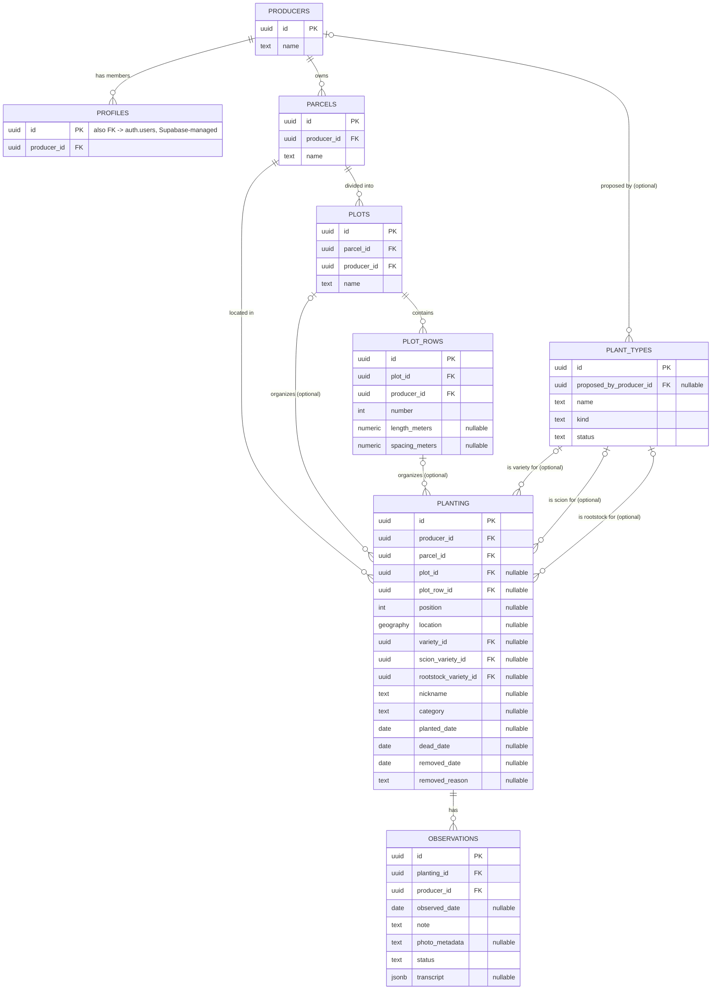

# Data model

The full set of tables and how they relate. This complements
[`docs/decisions/`](decisions) rather than duplicating it: this page shows
the *structure*; the ADRs explain *why* specific choices within it were
made.

## Reading this diagram

- **The hierarchy** (`producers > parcels > plots > plot_rows > planting`)
  is the backbone. `parcel_id` on `planting` is always required; `plot_id`
  and `plot_row_id` are only set for organized (gridded) plantings --
  see [0002](decisions/0002-planting-location-model.md).
- **`plant_types` is the one table that isn't producer-scoped.** It's a
  shared, global vocabulary -- `planting` references it three separate
  ways (`variety_id`, `scion_variety_id`, `rootstock_variety_id`)
  depending on whether a plant is own-rooted or grafted -- see
  [0004](decisions/0004-plant-types-kind-and-planting-columns.md).
- **`producer_id` is denormalized onto every table below `producers`**
  (not just reachable by joining up the chain), so RLS policies never
  need to walk the hierarchy to check access -- see
  [0001](decisions/0001-tenancy-membership-model.md). Those redundant
  `producer_id` columns exist on every table but aren't drawn as separate
  relationship lines here, to keep the diagram legible.
- **`position_status`** and **`planting_readable`** (views, not tables --
  see [0006](decisions/0006-planting-lifecycle-and-position-status.md))
  aren't shown above since they have no stored columns of their own;
  they're derived reads over `planting` and related tables.
- **`observations.status`** defaults to `pending` and only becomes
  `approved`/`rejected` after review; `transcript` holds the raw chat
  exchange a submission came from, when it came from the chat-based
  submission flow rather than a direct import -- see
  [0009](decisions/0009-chat-based-observation-submission.md).
- `auth.users` (Supabase-managed, not part of this project's own schema)
  isn't drawn as a full entity, but `profiles.id` is a foreign key into it.
